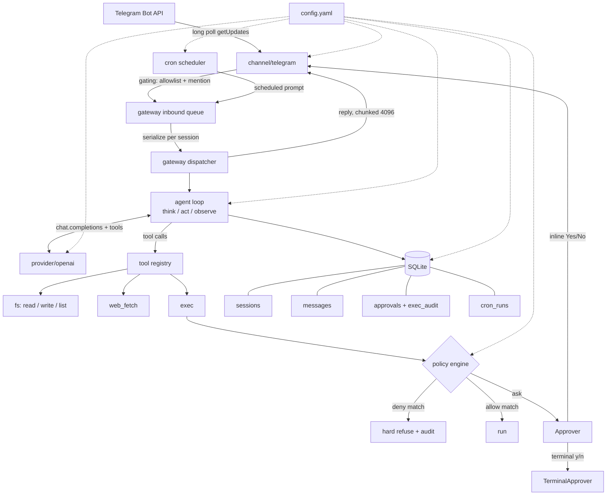

# Architecture

MTClaw is a single-binary personal AI agent gateway: one long-running
process that polls Telegram, runs an OpenAI-backed agent loop with real
tools, and replies in chat. No dashboard, no web UI, no HTTP/RPC control
surface - the YAML config file is the entire interface.

## Component diagram



## Package boundaries

```text
main.go                     thin: calls internal/cli.Execute()
internal/
  cli/        cobra commands: root, gateway, config, prompt, send, sessions,
              cron, approvals, doctor, onboard, version. The only package
              main.go imports.
  config/     types (yaml: tags, Duration), load (decode -> resolve secrets
              -> expand paths -> validate), defaults, validate, paths.
              A pure function of (file bytes, env map, OS) - no other
              package reads os.Getenv for config purposes.
  store/      interfaces (Store, SessionStore, MessageStore, ApprovalStore,
              AuditStore, CronRunStore), a generic SQL implementation (one
              file per table, e.g. sessions.go/messages.go), the portable
              embedded migrations/ (tokenized DDL, no driver-specific
              syntax), dialect.go (the Dialect seam every query rebinds
              placeholders and renders DDL tokens through), migrate.go (the
              schema_migrations ledger, embed + apply), and factory.go
              (Open(cfg)/Register(driver), a database/sql-style registry).
              sqlite/ is the only registered driver: it holds every SQLite-
              specific quirk (pragmas, connection pooling, the legacy
              PRAGMA user_version adoption path) behind Dialect, and
              registers itself via a blank import - internal/cli and
              internal/gateway's three production wiring sites import it
              only as `_ "…/internal/store/sqlite"`, never by name. Adding a
              second backend is one new package implementing Dialect below
              this same, unchanged Store interface.
  provider/   Provider interface + Request/Response/ToolSpec types,
              openai/ (the only package allowed to import the OpenAI SDK).
  agent/      the think/act/observe loop, prompt assembly, history
              trimming. Depends on provider and store's interfaces and on
              a ToolRunner interface - never on internal/tools directly.
  tools/      registry, filesystem/web_fetch/exec tools, the policy engine
              (deny -> allow -> mode), the auto-mode classifier, the
              Approver interface and its terminal/deny-all implementations.
  channel/    Channel interface + telegram/ (long polling, gating, message
              chunking, bot commands, the inline-keyboard approver). Only
              depends on config, store's interfaces, and tools' Approver/
              Request/RedactSecrets - never on agent's loop internals.
  gateway/    ties everything together for the long-running process: the
              inbound queue, per-session dispatch serialization, the
              instance lock, graceful shutdown.
  cron/       the scheduler loop and per-job tick logic; gronx for
              expression parsing only, overlap/catch-up policy is ours.
  logging/    slog handler construction from log.*.
  version/    build-stamped Version/Commit/Date, set via -ldflags.
  testsupport/  test-only: a fake HOME directory and httptest fakes of the
              Telegram Bot API and OpenAI's chat-completions endpoint.
              Imported exclusively from _test.go files across cli/gateway/
              this package's own fakeapi subpackage - nothing in a
              non-test build depends on it.
docs/         this file, configuration.md, security.md, telegram-setup.md,
              verification.md
```

Dependency direction is strictly inward: `channel` and `tools` depend on
`config`/`store`/`provider`'s interfaces; `agent` depends on `provider` and
`store` interfaces plus its own `ToolRunner` seam; `gateway` and `cli` are
the only packages allowed to wire concrete implementations together. No
package below `cli` imports `cli`, and no package other than `provider/openai`
imports the OpenAI SDK.

## Schema versioning

`internal/store/migrate.go` maintains a `schema_migrations` ledger table
(`version`, `name`, `applied_at`) as the authoritative record of which
migrations a database has applied - it replaced a bare `PRAGMA user_version`
check. The SQLite dialect (`internal/store/sqlite/dialect.go`) still sets
`PRAGMA user_version` to the ledger's highest applied version after every
successful migration, even though nothing in this codebase reads that pragma
back anymore.

This is deliberate, and load-bearing for safe downgrades: an older mtclaw
binary, built before the ledger existed, only ever knows how to check
`PRAGMA user_version` against its own highest embedded migration. Keeping
that pragma in sync means an old binary opening a database a newer binary
has since migrated still sees the correct version number and applies its own
"database is newer than I understand" refusal correctly, instead of reading
a stale `0` and either failing confusingly or - worse - trying to write to a
schema it cannot fully interpret. **A future migration author must not stop
updating `PRAGMA user_version` when adding a new migration**, even though
the ledger table alone would be sufficient for every current-binary purpose;
doing so would silently break the downgrade guard for anyone still running
an old binary.

## Request lifecycle

A Telegram direct message, end to end:

1. **Long poll.** `channel/telegram` receives a `telego.Update` from
   `UpdatesViaLongPolling`.
2. **Gating.** `telegram.Decide` (a pure function of config + message)
   checks the sender against `allow_from` (DM) or the group's effective
   allowlist plus `require_mention` (group/supergroup). A rejection is
   silent - no reply, no reaction - so a non-allowlisted sender gets no
   confirmation the bot even exists.
3. **Enqueue.** An accepted message becomes a `channel.Inbound` and is
   pushed onto the gateway's bounded inbound queue.
4. **Dispatch.** The gateway dispatcher serializes turns **per session**
   (one chat's messages never interleave with themselves) while allowing
   different sessions to run concurrently, up to a global concurrent-turn
   semaphore.
5. **Agent loop.** `agent.Loop.Run` loads recent history from the store,
   appends the new user message, and iterates think -> act -> observe:
   call the OpenAI provider, and for every tool call the model requests,
   dispatch it through the tool registry.
6. **Policy (exec only).** `tools.Policy.Evaluate` runs deny -> allow ->
   mode in that fixed order; an `approval`/`auto`-mode "ask" verdict blocks
   on an `Approver` (Telegram inline buttons for a chat turn, `DenyAllApprover`
   for a cron turn) before running or refusing.
7. **Buffer and flush.** Every message produced during the turn (assistant
   response, tool calls, tool results) is buffered in memory and flushed to
   the store **once**, in a single transaction, at the end of the turn -
   see `docs/security.md`'s note on the crash exposure this trades for.
8. **Reply.** The dispatcher hands the final text back to the channel,
   which chunks it to Telegram's message-length limit and sends it,
   MarkdownV2 with a plain-text fallback on a parse-mode rejection.

A cron-triggered turn follows the same agent-loop/policy/store path from
step 5 onward; it enters at the queue (step 3) via the scheduler instead of
a Telegram update, and its exec tool is always wired to `DenyAllApprover` -
see `docs/security.md` for why cron is allow-list-only.

## What we deliberately did not build

MTClaw is a small reimplementation of the
[openclaw](https://github.com/openclaw/openclaw)/[goclaw](https://github.com/nextlevelbuilder/goclaw)
shape, not a port of either project's full feature set. Each of the
following is a plausible follow-up project, and none of them is needed for
a working personal assistant:

- Dashboard / web control UI
- Non-Telegram channels (Slack, Discord, SMS, ...)
- Non-OpenAI model providers
- A WebSocket or HTTP control/RPC API
- Multi-tenancy (MTClaw is single-user by design: one config, one allowlist)
- Agent teams, delegation, or subagents
- Skills (`SKILL.md`) or an MCP bridge
- Vector memory / retrieval / conversation summarization
- Docker or VM sandboxing of tool execution (see `docs/security.md`'s
  confinement-is-not-a-sandbox note)
- Lifecycle hooks, pairing codes, media/TTS/STT, tracing/OpenTelemetry,
  browser control, a knowledge graph, or role-based access control

If you need any of these, look at openclaw or goclaw directly - they built
the full-featured versions this project intentionally did not.
