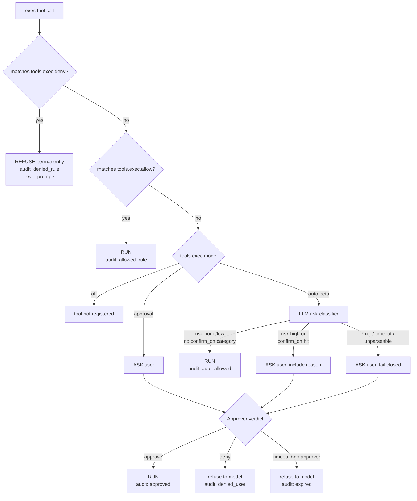

# Security model

Read this before you point MTClaw at a real Telegram bot. It exists so you
can make an informed decision about running this at all - it is not softened
for comfort.

## The threat model, stated plainly

This is the phase 5 design document's Security Model, verbatim:

> MTClaw turns a Telegram message into shell execution on the host. Anyone who can
> message the bot, and anyone who can inject text the model reads (a web page it
> fetches, a file it opens, a forwarded message), is attempting to run commands as
> your user account.
>
> The deny-list is the only real enforcement boundary. The LLM classifier in `auto`
> mode is a **convenience feature, not a security control** — it can be talked out
> of its judgment by the same injection that produced the command.

Concretely:

1. **Deny-list is checked first and cannot be overridden** - not by the allow-list,
   not by the classifier, not by user approval. A deny match is refused outright and
   the model is told it is refused permanently, so it stops rephrasing.
2. **Injection reaches exec through tool output.** `web_fetch` output is untrusted
   text that lands in the context. The classifier therefore only ever sees the
   command string and its cwd - never page content - so a page cannot address the
   classifier directly. This narrows the channel; it does not close it.
3. **`auto` mode ships off.** Default is `approval`. `onboard` does not offer `auto`.
   Enabling it is a deliberate config edit, and `doctor` prints a warning when it is on.
4. **Confinement is not a sandbox.** `tools.exec.cwd` is a starting directory, not a
   jail; any command can `cd`. Real isolation means containers/VMs and is explicitly
   out of scope. Say so rather than implying safety we do not provide.
5. **Denied ≠ error.** A refusal returns to the model as a tool *result*. The model
   should explain to the user that it was blocked, not retry silently.

**The plainest possible statement of the consequence: the Telegram bot token is
equivalent to shell access on this machine.** Anyone holding the token can message
the bot as if they were it; anyone the bot accepts messages from (your
`allow_from` list) can attempt to run commands as your user account, subject only
to the deny-list below. Telegram bot usernames are publicly discoverable - do not
hand the token, or an `allow_from` entry, to anyone you would not hand a shell to.

## The exec decision pipeline

Every `exec` tool call goes through this pipeline, in this order, with no
shortcuts:

Every ambiguity fails closed to **ASK**, never to RUN: a regex compile error
(caught at startup, before any command reaches this pipeline), a classifier
error/timeout/unparseable response, an approval timeout, or the absence of an
approver at all (cron turns always use `DenyAllApprover`) - all of these ask a
human, or refuse if none exists, never silently execute. The raw command
string reaches deny-list matching unmodified and first, with nothing ahead of
it in the pipeline that could downgrade a deny match to a prompt.

## What the deny-list does and does not stop

The default deny-list (written by `onboard`, OS-appropriate - see
`internal/tools/deny_defaults.go`) catches unconditionally destructive or
irreversible commands: recursive/forced `rm` (short flags, long flags, and
path-prefixed forms), `find -delete`, `mkfs`, writing to raw disk devices,
fork bombs, `shutdown`/`reboot`/`halt`, `chmod 777 /`, pipe-to-shell
downloads, force-pushes, account/password commands, and shell history
clearing - and the PowerShell equivalents on Windows.

**It stops accidents and naive prompt injection. It does not stop a
determined attacker who already has message access.** Base64-decode-then-pipe,
environment-variable indirection, writing a script to disk and then running
it, or simply rephrasing a blocked command in a way the regex does not
match, are all realistic bypasses. Each deny rule is also checked against a
lightly normalized copy of the command (quotes and a backslash directly
before the command word stripped, e.g. `'rm' -rf /` or `\rm -rf /`), which
closes the cheapest one-character rephrasing - but an interpreter wrapper
like `sh -c 'rm -rf /'`, `bash -c "..."`, or `eval "..."` is not unwrapped and
remains an accepted, documented bypass, same as base64-decode-then-pipe. The
honest boundary is: *do not give the bot token, or an allow_from entry, to
anyone you would not give a shell to.* That sentence belongs here and in the
README, not just here.

**Known accepted false positives**, recorded so a confused user knows the
fix instead of discovering it by trial and error: `docker rm -f <container>`
and `npm rm -f <package>` both match the `rm` deny patterns via the ` rm `
word boundary and are refused, even though neither is the dangerous
`rm -rf` they were written to catch. Over-blocking is the correct failure
direction here - a false-positive refusal costs you one `tools.exec.allow`
entry; an under-block costs data - but it is worth knowing about before it
surprises you mid-conversation.

An **empty deny-list with `tools.exec.enabled: true` is not a load error**,
but `mtclaw doctor` warns about it loudly, because it removes the only real
enforcement boundary in this design entirely.

## Why `auto` mode is beta

`auto` mode replaces "ask a human for every unmatched command" with "ask a
cheap LLM classifier, and only interrupt for what it flags as risky." This is
a genuine usability improvement for benign, repetitive commands - and a real
weakening of the security posture, because:

- The classifier is itself an LLM call, and LLM calls can be steered by
  adversarial input. The same prompt injection that produced a dangerous
  command in the first place can plausibly talk the classifier into scoring
  it as low-risk.
- The classifier only ever sees the command string, its cwd, and the shell -
  never the tool output that may have produced the command - which narrows
  the injection channel but does not close it.
- Any classifier failure (timeout, malformed response, error) already fails
  closed to asking a human; the risk is specifically in what the classifier
  *chooses to approve unattended when it is working correctly*.

Default is `approval`. `onboard` never offers `auto` as a choice - turning it
on is a deliberate, documented config edit, not an onboarding option - and
`mtclaw doctor` always prints a warning when `tools.exec.mode: auto` is set,
regardless of anything else in the config.

## Why cron is allow-list-only

A scheduled job runs with **no interactive approver at all** - there is no
human in the loop watching a terminal or a chat at 3am when a cron job fires.
`internal/tools.DenyAllApprover` is what a cron turn's exec tool gets wired
to, which means anything that would need a human decision (an unmatched
command under `approval` mode, or something the `auto` classifier flags) is
simply refused, with a message telling the model no interactive approver is
available. The only commands a cron job can ever run unattended are ones
that match `tools.exec.allow` outright. This is deliberately conservative:
letting a scheduled job silently prompt-and-timeout (or worse, silently run)
in the middle of the night is a worse failure mode than a cron job that
occasionally has to say "I couldn't run that without approval."

## Redaction is best-effort, not a boundary

An approval prompt **leaves the host**: the command is rendered into a
Telegram message that persists on Telegram's own servers indefinitely. A
command carrying an inline credential (`curl -H "Authorization: Bearer
sk-..."`, `PGPASSWORD=... psql`, `aws --secret-access-key ...`) would publish
that credential to a third party the moment MTClaw asks about it, so
`RedactSecrets` masks common credential shapes (`Bearer` tokens,
`Authorization:` headers, `--token`/`--password`/`--secret*` flags, `-p<value>`,
any `*_KEY=`/`*_TOKEN=`/`*_SECRET=`/`*_PASSWORD=`/`*_PASSWD=` assignment (so
`API_KEY=`, `GITHUB_TOKEN=`, `AWS_SECRET_ACCESS_KEY=`, and the bare
`PASSWORD=` form are all caught, not just the exact keyword alone), and
common key shapes like `sk-...`, `ghp_...`, `AKIA...`, and long base64/hex
runs) before a command ever reaches an approval prompt or the `exec_audit`
table.

**This is pattern matching over plain text, not a security boundary.** It
will miss credentials in shapes it does not recognize, and it does not
change what actually executes - only what is displayed and stored. The real
rule is: **do not let the agent handle credentials as command arguments.**
Put them in an env file the command reads instead, or in the shell
environment MTClaw's own process inherits, never as literal text the model
has to type into a command.

A spawned command's environment is not the full inherited environment
either: `exec` strips the specific variables MTClaw itself resolved its own
secrets from (`openai.api_key_env`, `channels.telegram.token_env`) before
starting the child, so `env` or `echo $OPENAI_API_KEY` inside a command
cannot read this process's own API key or bot token back out and hand it to
the model. Nothing else in the environment is filtered.

## The atomicity/crash exposure

A turn's messages (the assistant's response, its tool calls, and every tool
result) are buffered in memory and flushed to the store **once**, at the end
of the turn, in a single transaction. This gives an important correctness
property - a crash mid-turn loses the whole turn rather than leaving an
orphaned `tool_calls` row with no matching `tool` result, which would
otherwise poison the session for every future request - but it has a
security-relevant exposure: **a crash after a tool has already acted leaves
no history record that it acted.** If `exec` deletes a directory and the
process dies before the flush, the next turn's context contains no evidence
the command ran, and the model may attempt to run it again.

`exec_audit` (deliberately outside that transaction, and outside the session
delete cascade) is the recovery path: it is the only durable record that a
side effect happened, independent of whether the enclosing turn ever
finished. `mtclaw approvals list` is how you read it. There is no automatic
reconciliation between `exec_audit` and session history in v1 - after a
crash, check the audit log yourself before trusting the model's next answer
about what it has and has not already done.

## What is deliberately not built

No sandbox, no containerization, no seccomp/AppArmor profile, no network
namespace. `tools.exec.cwd` and `tools.filesystem.roots` are confinement by
convention (path checks), not by kernel enforcement. If you need real
isolation, run MTClaw itself inside a container or VM you control - that is
a deployment choice outside this project's scope, not something the config
schema can express.
