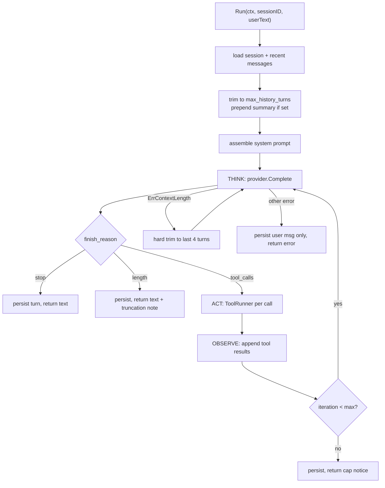

# Phase 4: Agent Loop

## Overview

The Think → Act → Observe cycle: assemble a prompt from config + session history,
call the provider, execute returned tool calls, feed results back, repeat until the
model produces text. Persists every turn atomically. This is the component that
makes MTClaw an agent rather than a chat relay.

## Requirements

**Functional**
- Bounded iteration count per turn (`agent.max_iterations`).
- History loaded from the store, trimmed to `agent.max_history_turns`.
- Tool execution delegated to a `ToolRunner` interface (implemented in phase 5).
- Progress callbacks so a channel can report which tool is running.
- `NO_REPLY` sentinel suppresses the outbound message.
- Cancellation persists what happened so far and returns cleanly.
- Retry once on `ErrContextLength` after a hard trim.

**Non-functional**
- Zero knowledge of Telegram or of any concrete tool. Depends only on
  `provider.Provider`, `store.Store`, and `ToolRunner`.
- Every exit path persists or explicitly discards; no silent history loss.

## Architecture



### Turn buffering and atomicity

Messages accumulate in an in-memory buffer during the turn and are flushed to the
store **once**, in a single `Append`, at the end. This gives the atomicity property
phase 2 built for: a crash mid-turn loses the whole turn rather than leaving an
assistant `tool_calls` row with no matching `tool` rows — which would make every
subsequent request to OpenAI fail with an orphaned `tool_call_id` error.

Two consequences to accept deliberately:

- A long turn is invisible to `sessions show` until it completes. That is the right
  trade against a permanently poisoned session.
- **A crash after a tool has already acted leaves no history record that it acted.**
  If `exec` deletes a directory and the process dies before the flush, the next turn's
  context contains no evidence the command ran, and the model may run it again. The
  atomicity trade is still correct — the alternative is a session that can never make
  another API call — but the exposure is real and must be documented rather than
  discovered. `exec_audit` (phase 2, deliberately outside the transaction and outside
  the cascade) is the recovery path: it is the only durable record that a side effect
  happened, and it is written for a human to read, not the model.

On cancellation, flush with a background context (not the canceled one) so the
partial turn is still recorded, following goclaw's `FinalizeStage` behaviour.

### System prompt assembly

Assembled fresh each turn, in order:

1. Identity — `agent.name`, current date/time with timezone, OS/arch, hostname.
2. Workspace — the resolved `agent.workspace` path and a statement that file tools are confined to `tools.filesystem.roots`.
3. Tool guidance — one line per registered tool; **generated from the registry**, never hand-maintained.
4. Exec policy posture — the active mode, and that denied commands cannot be retried by rephrasing.
5. Contents of each `agent.system_prompt_files`, concatenated in order, each under a header naming its source path.
6. Conventions — reply in the user's language; reply `NO_REPLY` when no response is warranted; keep chat replies short since the surface is a phone.

Missing prompt files are a warning at load, not a fatal error — a user editing
`AGENTS.md` should not brick the gateway.

### History trimming

**One mechanism: hard trim.** Keep the last `max_history_turns` *turns*, where a turn
is a user message plus everything up to the next user message. Trimming must never
split an assistant `tool_calls` message from its `tool` results — cut only at user
boundaries. This is the single most common source of API 400s in this design.

No token counting in v1 — `tiktoken` is a dependency and an approximation. Turn counts
plus the `ErrContextLength` retry path cover the same ground for less code.

**No summarization in v1.** An earlier draft carried a `summarize_after_turns` option
that would compact old turns into `sessions.summary`. It is cut: it shipped disabled,
so it bought nothing by default, while costing a config key, a provider call path, a
progress event, and its own tests. The `sessions.summary` column stays in the schema
(it is one `TEXT NOT NULL DEFAULT ''`) so adding compaction later needs no migration,
and the loop still injects it as a system message when non-empty — nothing writes it
in v1. If context growth becomes a real complaint, that is a later plan with evidence
behind it, not speculative machinery now.

### Interfaces

```go
package agent

type ToolRunner interface {
    Specs() []provider.ToolSpec
    // Run never returns a Go error for tool-level failures: a failed tool
    // produces a result string describing the failure so the model can react.
    // Errors are reserved for infrastructure faults that should abort the turn.
    Run(ctx context.Context, call provider.ToolCall, meta Meta) (string, error)
}

type Meta struct {
    SessionID string
    Channel   string
    ChatID    string
    ThreadID  string // forum topic; routes approver prompts and replies
}

type Progress func(Event) // ToolStarted, ToolFinished, Iteration

type Loop struct {
    cfg      config.Agent
    prov     provider.Provider
    store    store.Store
    tools    ToolRunner
    log      *slog.Logger
}

type Result struct {
    Text       string
    NoReply    bool
    Iterations int
    Usage      provider.Usage
    Err        error
}

func (l *Loop) Run(ctx context.Context, sessionID, userText string, onProgress Progress) Result
```

The `Run` contract on tool failure is load-bearing: a tool that returns
`"error: permission denied"` as its *result* lets the model apologize or try
another approach. A tool that returns a Go error kills the turn and the user sees
nothing useful.

## Related Code Files

- Create: `internal/agent/loop.go` — `Run`, the iteration cycle
- Create: `internal/agent/prompt.go` — system prompt assembly
- Create: `internal/agent/history.go` — turn segmentation, hard trim
- Create: `internal/agent/events.go` — `Progress`, `Event`
- Create: `internal/agent/loop_test.go`, `history_test.go`, `prompt_test.go`
- Create: `internal/cli/prompt_cmd.go` — `mtclaw prompt "…"`, a terminal-only turn
- Modify: `internal/store/types.go` — add conversion between `store.Message` and `provider.Message`

## Implementation Steps

1. `history.go` — `SegmentTurns([]provider.Message) []Turn` splitting on `role=="user"`.
   `HardTrim(msgs, maxTurns)` keeps whole trailing turns only. Assert in a test that
   output never begins with a `tool` message and never contains an assistant
   `tool_calls` whose ids lack matching `tool` rows.
2. `prompt.go` — `Build(cfg, toolSpecs, now)` returning the system string. Tool lines
   derived from `Specs()`. Read prompt files, log and skip missing ones.
3. `loop.go` skeleton: load session, load `Recent(max_history_turns*8)` as a raw
   fetch, convert, segment, hard trim.
4. Iteration cycle:
   - Build request: system + `sessions.summary` as a system message when non-empty
     (nothing writes it in v1) + trimmed history + new user message.
   - `provider.Complete`.
   - On `ErrContextLength`: hard trim to the last 4 turns, clear the summary from the
     request, retry once. A second failure returns the error to the user.
   - On other errors: flush only the user message, return the classified error.
   - `finish_reason == "tool_calls"`: buffer the assistant message, run each call
     sequentially via `ToolRunner.Run`, buffer a `tool` message per call (always one
     per call id, even on failure — a missing tool result is an API error next turn),
     emit progress events, increment, continue.
   - `finish_reason == "stop"`: buffer the assistant message, flush, return text.
   - `finish_reason == "length"`: same, appending a note that output was truncated.
5. Iteration cap: buffer a final assistant message stating the cap was hit, flush,
   return that text so the user learns why it stopped.
6. `NO_REPLY`: exact trimmed match on the final text sets `Result.NoReply`. Still
   persisted, so the transcript is honest about what the model produced.
7. Usage: accumulate across all iterations, one `AddUsage` at flush time.
8. Cancellation: on `ctx.Err()`, flush the buffer with `context.WithoutCancel(ctx)`
   and return `ErrCanceled`.
9. `prompt_cmd.go`: ensure a `channel="cli"` session (fixed chat id `local`), run
    the loop with a progress printer writing tool activity to stderr, print the final
    text to stdout. Accepts `--session` to reuse a specific session and `--new` to
    force a fresh one.

**Sequencing note.** Until phase 5 lands, wire a `ToolRunner` returning zero specs.
The loop is then fully testable — including the tool path, via a fake runner in
tests — and `mtclaw prompt` already works as a persistent plain chat client. This is the
plan's first runnable milestone; phase 5 makes it the first useful one.

## Tests / Validation

All against `provider/mock`, no network:

- Single-shot: no tool calls, one iteration, correct persisted role sequence.
- Tool path: script tool call → final. Assert exactly one assistant + one tool row
  buffered per call and that the second request carries the tool result.
- Two tool calls in one assistant message produce two `tool` messages with matching ids.
- Tool returning an error *string* keeps the loop alive; tool returning a Go error aborts.
- Iteration cap: mock always returns tool calls; assert exactly `max_iterations`
  provider calls and a cap notice in the result.
- `ErrContextLength` on the first call, success on the retry: one retry only, and the
  retried request is measurably smaller.
- Cancel mid-turn: partial turn persisted, `ErrCanceled` returned.
- Hard trim invariants (property-style over generated histories): never starts with
  `tool`, never orphans a `tool_calls`.
- `NO_REPLY` sets the flag and still persists.
- Prompt assembly: missing prompt file logs and continues; tool lines match registry specs.

## Success Criteria

- [ ] `mtclaw prompt "hello"` completes a turn and persists it (command is wired and tested against `provider/mock`; not exercised against a live OpenAI endpoint - no network/API key in this environment)
- [ ] Restarting and running `mtclaw prompt` again shows the model retains prior context (same caveat: `--session`/default `cli/local` reuse is implemented and covered by store-level session tests, not a live end-to-end run)
- [x] A scripted 3-tool-call conversation persists a valid message sequence
- [x] Trimming never produces an orphaned `tool_calls` or a leading `tool` message
- [x] Iteration cap is enforced and explained to the user
- [x] Context-length overflow recovers via one retry
- [x] Cancellation leaves a coherent transcript
- [x] `internal/agent` imports no channel, no tool implementation, and no OpenAI SDK

## Risk Assessment

- **Orphaned tool calls are the defining failure mode** of this phase: once a session
  contains an assistant `tool_calls` with no matching `tool` result, every future
  request in that session fails and the user's only recourse is deleting the session.
  Three defenses: buffer-then-single-flush, always emit one tool message per call id
  even on failure, and trim only at user boundaries. Test each independently.
- **Sequential tool execution** is a deliberate simplification. Parallel read-only
  batching (what goclaw's `ToolStage` does) is a later optimization; doing it now
  adds ordering bugs for latency the user will not notice on a phone.
- **Iteration cap chosen badly** either truncates real work (too low) or burns money
  in a loop (too high). Default 20 matches both upstreams. The cap notice must be
  visible so a user hitting it can raise it knowingly.
- **Hard trim alone loses old context silently.** With summarization cut, a long
  conversation simply forgets its early turns — no summary, no notice. This is the
  accepted v1 behaviour and the reason `max_history_turns` is user-tunable. If users
  notice the forgetting, compaction becomes a later plan with real evidence behind it.
