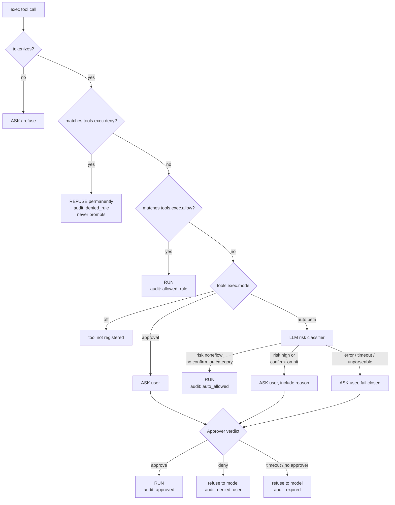

# Phase 5: Tools and Policy Engine

## Overview

The tools that make MTClaw useful, and the policy layer that keeps them from being
catastrophic: filesystem read/write/list confined to configured roots, HTTP fetch,
and shell exec gated by a deny-list → allow-list → approval pipeline with an
optional LLM-classified `auto` mode.

This is the highest-risk phase in the plan. Read the Security Model before writing
code.

## Requirements

**Functional**
- Tool registry producing `provider.ToolSpec`s and dispatching calls by name.
- Filesystem: `read_file`, `write_file`, `list_dir`, all confined to `tools.filesystem.roots`.
- `web_fetch`: GET a URL, return readable text, size- and time-bounded.
- `exec`: run a shell command under the policy pipeline.
- Policy decisions in strict order: **deny-list → allow-list → mode**.
- `mode: approval` asks the user every unmatched command.
- `mode: auto` (beta) asks an LLM classifier and only interrupts for dangerous commands.
- `mode: off` does not register the exec tool at all.
- Every exec decision written to `exec_audit`.
- `Approver` interface with terminal and (phase 6) Telegram implementations.

**Non-functional**
- Fail closed on every ambiguity: regex error, classifier error, classifier timeout,
  approval timeout, unparseable command → **ask**, or refuse if no approver exists.
- Path confinement resolved against symlinks, not string prefixes.

## Security Model

State this in `docs/security.md` verbatim, because it is the thing users will get
wrong:

> MTClaw turns a Telegram message into shell execution on the host. Anyone who can
> message the bot, and anyone who can inject text the model reads (a web page it
> fetches, a file it opens, a forwarded message), is attempting to run commands as
> your user account.
>
> The deny-list is the only real enforcement boundary. The LLM classifier in `auto`
> mode is a **convenience feature, not a security control** — it can be talked out
> of its judgment by the same injection that produced the command.

Concretely:

1. **Deny-list is checked first and cannot be overridden** — not by the allow-list,
   not by the classifier, not by user approval. A deny match is refused outright and
   the model is told it is refused permanently, so it stops rephrasing.
2. **Injection reaches exec through tool output.** `web_fetch` output is untrusted
   text that lands in the context. The classifier therefore only ever sees the
   command string and its cwd — never page content — so a page cannot address the
   classifier directly. This narrows the channel; it does not close it.
3. **`auto` mode ships off.** Default is `approval`. `onboard` does not offer `auto`.
   Enabling it is a deliberate config edit, and `doctor` prints a warning when it is on.
4. **Confinement is not a sandbox.** `tools.exec.cwd` is a starting directory, not a
   jail; any command can `cd`. Real isolation means containers/VMs and is explicitly
   out of scope. Say so rather than implying safety we do not provide.
5. **Denied ≠ error.** A refusal returns to the model as a tool *result*. The model
   should explain to the user that it was blocked, not retry silently.

### Decision pipeline



### Classifier contract (`auto` mode)

A separate, cheap provider call. Input is the command, the cwd, and the shell —
nothing else. Output is forced JSON:

```json
{
  "risk": "none|low|high",
  "categories": ["destructive","privileged","network","secret_access","none"],
  "reason": "one sentence, shown to the user in the approval prompt"
}
```

Ask when `risk == "high"` **or** any returned category is in
`tools.exec.auto.confirm_on`. Categories are defined narrowly:

| Category | Means |
|---|---|
| `destructive` | deletes, overwrites, or truncates data; force-pushes; drops tables |
| `privileged` | sudo/doas/runas, service or firewall changes, writes outside the workspace |
| `network` | sends data outward or fetches code to execute (`curl … \| sh`) |
| `secret_access` | reads credential stores, `.env`, ssh keys, keychains, token files |

Classifier call uses a short timeout (10s) and `max_retries: 0`. Any failure asks.
The classifier's `reason` is included in the approval prompt so the user sees *why*
they were interrupted.

### Default deny-list

Shipped by `onboard` as a starting point, documented as necessary-not-sufficient
and shell-specific:

```yaml
deny:
  # recursive/forced rm — short flags, long flags, and path-prefixed invocations
  - '(^|[;&|]\s|\s)(/\S*/)?rm\s+([^|;&]*\s)?-[a-zA-Z]*[rf]'
  - '(^|[;&|]\s|\s)(/\S*/)?rm\s+([^|;&]*\s)?--(recursive|force)\b'
  - '\bfind\b[^|;&]*\s-delete\b'
  - '\bmkfs(\.|\s)'
  - '\bdd\s+.*\bof=/dev/'
  - ':\(\)\s*\{.*\};\s*:'                                # fork bomb
  - '\b(shutdown|reboot|halt|poweroff)\b'
  - '>\s*/dev/(sd|nvme|disk)'
  - '\bchmod\s+(-[a-zA-Z]+\s+)*(-R\s+)?777\s+/'
  - '\b(curl|wget)\b.*\|\s*(sudo\s+)?(ba|z|da)?sh'       # pipe-to-shell
  - '\bgit\s+push\b.*(--force(-with-lease)?|-f)\b'
  - '\b(userdel|groupdel|passwd)\b'
  - '\bhistory\s+-c\b'
```

Regexes are matched against the raw command string, case-sensitively, and each is
compiled once at config load (phase 1 already validates they compile).

**Why the `rm` patterns look the way they do.** An earlier draft used
`(^|[;&|]\s*)rm\s+(-[a-zA-Z]*\s+)*-[a-zA-Z]*[rf]`, which has two bypasses that were
found by hand-tracing the regex, not by testing:

- `rm --recursive --force /` — `-[a-zA-Z]*` cannot consume a long option (it matches
  `-` then stops at the second `-`), so the group fails and the pattern never matches.
- `/bin/rm -rf /` — the `(^|[;&|])` anchor requires `rm` at a command boundary, and a
  path prefix is neither.

Both are unconditionally destructive commands passing the *only* real enforcement
boundary in this design. The replacement handles long options, optional path prefixes,
and intervening arguments. **The lesson generalizes: hand-written deny regexes are
wrong until proven otherwise by a corpus.** The test corpus below is therefore a
required deliverable of this phase, not optional coverage.

## Related Code Files

- Create: `internal/tools/registry.go` — `Registry`, `Register`, `Specs`, `Run` (implements `agent.ToolRunner`)
- Create: `internal/tools/spec.go` — helper for building JSON schemas
- Create: `internal/tools/fs.go` — `read_file`, `write_file`, `list_dir`
- Create: `internal/tools/path_guard.go` — `Resolve(root(s), userPath)` with symlink resolution
- Create: `internal/tools/web_fetch.go`
- Create: `internal/tools/exec.go` — the exec tool
- Create: `internal/tools/policy.go` — `Decision`, `Policy.Evaluate`
- Create: `internal/tools/classifier.go` — the `auto`-mode risk classifier
- Create: `internal/tools/approver.go` — `Approver` interface, `TerminalApprover`, `DenyAllApprover`
- Create: `internal/tools/policy_test.go`, `path_guard_test.go`, `exec_test.go`, `classifier_test.go`, `fs_test.go`, `web_fetch_test.go`
- Create: `internal/cli/approvals_cmd.go` — read-only `approvals list`
- Modify: `internal/cli/prompt_cmd.go` — wire the real registry and `TerminalApprover`
- Modify: `docs/security.md` — the model above

## Implementation Steps

1. `registry.go`: `map[string]Tool` where
   `Tool{ Spec provider.ToolSpec; Run func(ctx, args json.RawMessage, meta agent.Meta) (string, error) }`.
   Dispatch by name; unknown name and malformed args both return a *result string*
   describing the problem (so the model self-corrects), never a Go error.
2. `path_guard.go` — the confinement primitive:
   - reject empty paths and paths containing a NUL byte
   - expand `~`, make absolute against the first root
   - `filepath.EvalSymlinks` on the deepest existing ancestor, then rejoin the
     non-existent tail (needed so `write_file` to a new file still resolves correctly)
   - require the result to be inside a root: compare via `filepath.Rel` and reject
     when the relative path starts with `..`, **not** by string prefix (`/data-evil`
     must not pass a `/data` prefix check)
   - case-insensitive comparison on Windows and macOS
3. `fs.go`:
   - `read_file(path, offset?, limit?)` → truncates at `max_read_bytes` with an
     explicit truncation marker; refuses binary content (NUL sniff in the first 8KB)
   - `write_file(path, content, mode?)` where mode is `overwrite|append|create_new`,
     bounded by `max_write_bytes`, creating parent dirs inside the root only
   - `list_dir(path, depth?)` → names, sizes, types; caps entry count; never follows
     symlinks out of the root
4. `web_fetch.go`: GET only; enforce `http`/`https`; **reject private, loopback,
   and unspecified address space at connect time** using a `net.Dialer.Control` hook so
   a redirect or DNS rebind cannot slip past the check. Full blocklist — an incomplete
   one is the usual way this check fails:
   - IPv4: `0.0.0.0/8`, `10/8`, `127/8`, `169.254/16` (cloud metadata), `172.16/12`,
     `192.168/16`, `100.64/10` (CGNAT), `224/4`
   - IPv6: `::` (unspecified), `::1`, `fc00::/7`, `fe80::/10` (link-local), `ff00::/8`
   - **IPv4-mapped IPv6** (`::ffff:127.0.0.1`) — checked by converting via `To4()`
     first and re-running the IPv4 rules, otherwise every IPv4 rule above is trivially
     bypassed
   Prefer `netip.Addr` plus `IsLoopback`/`IsPrivate`/`IsLinkLocalUnicast`/
   `IsUnspecified` over hand-written CIDR lists where the stdlib already covers it, and
   keep the explicit CIDRs only for what it does not (metadata, CGNAT, multicast).
   Cap at `max_bytes`; cap redirects at 3;
   strip scripts/styles and collapse HTML to text; return with a note that the
   content is untrusted third-party text.
5. `policy.go`:
   ```go
   type Verdict int // VerdictRun, VerdictRefuse, VerdictAsk
   type Decision struct {
       Verdict Verdict
       Audit   string // denied_rule|allowed_rule|approval|auto_allowed
       Rule    string
       Reason  string
   }
   func (p *Policy) Evaluate(ctx context.Context, cmd string) Decision
   ```
   Deny loop first, allow loop second, then mode switch. `off` is unreachable here
   because the tool is not registered. Pure function apart from the classifier call —
   keep the classifier behind an interface so tests inject a fake.
6. `classifier.go`: build the JSON-only prompt, call the provider with
   `auto.model` (falling back to `agent.model`), 10s timeout, unmarshal strictly.
   Any error, timeout, or unparseable response → `VerdictAsk` with
   `Reason: "risk classification unavailable"`. Never returns `VerdictRun` on error.
7. `approver.go` — and note that an approval prompt **leaves the host**. The command is
   rendered into a Telegram message that persists on Telegram's servers indefinitely, so
   a command carrying an inline credential (`curl -H "Authorization: Bearer sk-…"`,
   `PGPASSWORD=… psql`, `aws --secret-access-key …`) publishes that credential to a third
   party the moment MTClaw asks about it. Add `RedactSecrets(cmd string) string`, applied
   to the approval prompt *and* to the `exec_audit.command` column:
   - mask values following `Bearer`, `Authorization:`, `--token`, `--password`,
     `--secret*`, `-p<value>`, and `KEY=`/`TOKEN=`/`SECRET=`/`PASSWORD=` assignments
   - mask anything matching common key shapes (`sk-…`, `ghp_…`, `AKIA…`, long base64/hex runs)
   - truncate the displayed command at 800 characters with an explicit marker
   The *executed* command is never altered — redaction applies only to what is displayed
   and stored. Document that redaction is best-effort pattern matching, so the real rule
   stays "do not let the agent handle credentials as command arguments".
   ```go
   type Request struct { SessionID, Channel, ChatID, Tool, Command, Reason string }
   type Approver interface {
       Ask(ctx context.Context, req Request) (approved bool, err error)
   }
   ```
   `TerminalApprover` prints the command plus reason and reads `y/N` from stdin with
   the configured `approval_timeout`. `DenyAllApprover` is the default when no
   approver is wired (used by cron — see phase 8) and always denies with a message
   telling the model no interactive approver is available.
8. `exec.go`:
   - resolve shell: `tools.exec.shell` if set, else `[/bin/bash, -lc]` on POSIX and
     `[powershell, -NoProfile, -Command]` on Windows
   - tokenize with `go-shellwords` for display and for the audit record; a tokenize
     failure means ASK (fail closed), not RUN
   - `Evaluate`; on `VerdictAsk`, create an `approvals` row, call the `Approver`,
     record the decision
   - run under `exec.CommandContext` with a context **derived from the turn context**,
     not a standalone one: `ctx, cancel := context.WithTimeout(turnCtx, cfg.Timeout)`.
     The timeout is an *additional* bound, not a replacement. A standalone context is
     the reason `/stop` would otherwise return control to the user while the command
     keeps running — and shutdown would leave orphaned processes behind.
   - set the process group and kill the whole group on cancel or timeout so children do
     not survive; on POSIX use `Setpgid` plus `syscall.Kill(-pgid, SIGKILL)`, and note
     that Windows needs a job object or `taskkill /T` for equivalent behaviour
   - capture combined stdout+stderr up to `max_output_bytes`, mark truncation
   - return a result string containing exit code, duration, and output; a non-zero
     exit is a normal result, not a Go error
   - write `exec_audit` on every path including refusals
9. `approvals_cmd.go`: read-only listing of recent approvals with state and decider.
   Deciding from the CLI is intentionally absent — the gateway holds the waiting
   goroutine in memory, so a CLI decision would need IPC that v1 does not have.
   Document this.
10. Update `prompt_cmd.go` to construct the full registry with `TerminalApprover`,
    making `mtclaw prompt` a complete local agent. **This is the first *useful* milestone
    of the whole plan** — phase 4 already runs, but this is where it can do work.

## Tests / Validation

- **Policy table** (the most important test in the codebase): for each of deny-match,
  allow-match, both-match (deny must win), neither-match under each mode, classifier
  low/high/error/timeout — assert verdict, audit label, and that deny never reaches
  an approver.
- **Deny-list corpus** (required deliverable, not optional coverage). Must-catch list
  includes at minimum: `rm -rf /`, `rm -fr ~`, `rm --recursive --force /tmp/x`,
  `rm --force --recursive /`, `/bin/rm -rf /`, `sudo /bin/rm -rf --no-preserve-root /`,
  `find . -delete`, `curl x | sh`, `wget -O- x | sudo bash`, `git push --force`,
  `git push --force-with-lease`, `dd if=/dev/zero of=/dev/sda`, `mkfs.ext4 /dev/sda1`,
  the fork bomb, `shutdown -h now`. Must-NOT-catch list includes at minimum:
  `rm ./tmpfile`, `git push`, `git push origin main`, `curl https://x -o f`,
  `find . -name '*.go'`, `ls -alrt`, `df -h`, `history`, `grep -rf patterns .`
  (contains `-rf` but is not `rm`), `npm rm left-pad`, `docker rm container`.
  The last three are the ones a careless pattern gets wrong.
- **Known accepted false positives**, asserted as *denied* so the behaviour is recorded
  rather than discovered: `docker rm -f <ctr>` and `npm rm -f <pkg>` match the `rm`
  patterns via the ` rm ` word boundary and are refused. Over-blocking is the correct
  failure direction — a refusal costs the user an allow-list entry, an under-block costs
  data — but the docs must name these two so a confused user knows the fix.
- **Path guard**: `..` traversal, absolute path outside root, symlink pointing
  outside, symlink inside, non-existent file in an existing dir, `/data-evil` vs
  `/data` prefix confusion, Windows case and drive-letter differences, NUL byte.
- **SSRF**: `http://127.0.0.1`, `http://169.254.169.254`, `http://10.0.0.1`,
  `http://0.0.0.0`, `http://[::1]`, `http://[::ffff:127.0.0.1]`, `http://[fe80::1]`, a
  hostname resolving to a private IP, and a public URL that redirects to localhost —
  all rejected. A normal public URL still succeeds (guard against over-blocking).
- **Exec**: non-zero exit is a result not an error; timeout kills the process group
  (assert a spawned child is dead); **turn-context cancellation kills the process group
  too** (start `sleep 60`, cancel the turn context, assert the process is gone within a
  second); output over cap is truncated and marked; audit row written on every path.
- **Redaction**: `curl -H "Authorization: Bearer sk-abc123" x` yields an approval prompt
  and an audit row containing neither `sk-abc123` nor the bearer value, while the
  command actually executed is byte-identical to the original.
- **Approver**: approve, deny, and timeout all produce the right audit label and the
  right model-facing string; `DenyAllApprover` never blocks.
- **Classifier**: fake provider returning malformed JSON, empty body, timeout, and
  `risk:"none"` with a `confirm_on` category present (must still ask).
- **fs**: read truncation marker, binary refusal, `create_new` on an existing file
  fails, write outside root fails, `list_dir` entry cap.

## Success Criteria

- [ ] `mtclaw prompt "what files are in my workspace"` completes a real tool-using turn
- [ ] A deny-listed command is refused with no prompt, audited as `denied_rule`
- [ ] Deny wins over an allow-list entry matching the same command
- [ ] An allow-listed command runs with no prompt
- [ ] In `approval` mode an unmatched command prompts at the terminal; `n` returns a refusal to the model as a result
- [ ] In `auto` mode a benign command runs unprompted and a destructive one prompts with the classifier's reason
- [ ] Classifier timeout or malformed output results in a prompt, never a silent run
- [ ] The full deny-list corpus passes: every must-catch command denied, every must-not-catch command allowed through to the next policy stage
- [ ] `rm --recursive --force /` and `/bin/rm -rf /` are both denied
- [ ] Path traversal, symlink escape, and prefix-confusion attempts all fail
- [ ] `web_fetch` refuses loopback, unspecified, link-local, private, and IPv4-mapped-IPv6 targets, including via redirect, while still fetching a normal public URL
- [ ] Exec timeout leaves no surviving child processes
- [ ] Cancelling the turn context kills the running command and its children
- [ ] Approval prompts and audit rows are secret-redacted; the executed command is not modified
- [ ] Every exec attempt appears in `exec_audit` with a decision label
- [ ] `mode: off` produces a registry with no exec tool and a system prompt that says so

## Risk Assessment

- **This phase is where MTClaw can destroy data or leak credentials.** The mitigations
  above are the deliverable, not garnish. If schedule pressure appears, cut `auto`
  mode (leaving `approval` only) — never cut the deny-list, the path guard, or the audit.
- **The deny-list is bypassable by an adversarial model or user**: base64-decode-pipe,
  environment indirection, writing a script then running it. It stops accidents and
  naive injection, not a determined attacker who already has message access. The honest
  boundary is "do not give the bot token to people you would not give a shell to" and
  that sentence belongs in the README, not just the docs.
- **`auto` mode is beta and labeled so** in config comments, `doctor` output, and the
  approval prompt itself. The classifier adds a provider call and latency to every
  unmatched command; that cost is why it is opt-in.
- **SSRF via `web_fetch`** is a real path to cloud metadata credentials on a VPS
  install. The `Dialer.Control` approach checks the *actual* connect address, which is
  the only version that survives redirects and DNS rebinding.
- **Windows shell semantics differ enough that the default deny-list is partly
  ineffective there** (`rm -rf` is not the danger; `Remove-Item -Recurse -Force` is).
  Ship an OS-appropriate default deny-list from `onboard` and document the gap.
