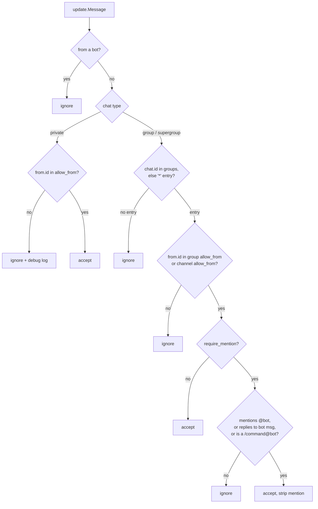

# Phase 6: Telegram Channel

## Overview

The chat surface: long-polling Telegram bot with access gating, message chunking,
bot commands, typing/progress feedback, and the inline-keyboard implementation of
the phase-5 `Approver`.

## Requirements

**Functional**
- Long polling via `telego` — no webhook, no public URL, no TLS.
- DM access limited to `channels.telegram.allow_from` (numeric user IDs).
- Group access via `channels.telegram.groups`, honouring `require_mention`.
- Replies split to Telegram's 4096-character limit at safe boundaries.
- Bot commands: `/start`, `/new`, `/status`, `/whoami`, `/stop`, `/help`.
- Typing action while a turn runs; a progress note when a tool is slow.
- Inline Yes/No approval prompts resolving the phase-5 `Approver`.
- Markdown send with automatic plain-text fallback.

**Non-functional**
- Channel depends on `agent`/`tools` interfaces only — it does not import the loop's internals.
- Fail closed: unknown chat, unknown user, or missing group entry → ignore silently.

## Architecture

Verified API surface from
[`telego/examples`](https://github.com/mymmrac/telego/tree/main/examples):

```go
bot, err := telego.NewBot(token)
updates, _ := bot.UpdatesViaLongPolling(ctx, &telego.GetUpdatesParams{Timeout: 30},
    telego.WithLongPollingUpdateInterval(0),
    telego.WithLongPollingRetryTimeout(8*time.Second),
    telego.WithLongPollingBuffer(100))
for update := range updates {
    if update.CallbackQuery != nil { /* approval verdict */ }
    if update.Message != nil { /* inbound */ }
}

kb := tu.InlineKeyboard(tu.InlineKeyboardRow(
    tu.InlineKeyboardButton("✅ Approve").WithCallbackData("ok:"+id),
    tu.InlineKeyboardButton("🚫 Deny").WithCallbackData("no:"+id)))
bot.SendMessage(ctx, tu.Message(tu.ID(chatID), text).WithReplyMarkup(kb))
```

Closing the context closes the updates channel, which is the graceful-shutdown hook
phase 7 uses.

### Access gating

Evaluated in this order; the first rule that matches decides. Rejections are
**silent** — no reply, no reaction, nothing that confirms the bot exists.



Details that matter:

- Supergroup IDs are negative and start with `-100`. They belong under
  `channels.telegram.groups` keyed as strings. A positive ID there is a config error
  (phase 1 validates it).
- The bot's own username comes from a `getMe` call at startup, cached for the process
  lifetime. Mention detection uses `entities` of type `mention`/`bot_command` against
  that username — never a bare substring search for the name.
- A reply to one of the bot's messages counts as a mention. This is what makes group
  threads usable.
- Telegram's **privacy mode** means a non-admin bot does not receive most group
  messages at all. That is a Telegram-side setting, not ours; `docs/telegram-setup.md`
  must cover `/setprivacy` and re-adding the bot afterwards, because otherwise
  `require_mention: false` looks broken.

### Session mapping

`store.Sessions().Ensure("telegram", chatID, threadID)` where `threadID` is the
forum topic id (`message.message_thread_id`) when present, else `""`. A forum topic
is its own conversation; a plain group is one conversation.

### Chunking

Telegram rejects messages over 4096 characters. Split at, in order of preference:
paragraph break, line break, sentence end, hard cut. Never split inside a fenced
code block — close the fence, open a new one in the next chunk with the same
language tag. Send chunks sequentially with a small delay to stay under rate limits;
prefix multi-chunk messages with nothing (no "1/3" noise) but keep order guaranteed
by sending serially.

### Formatting

Send with `parse_mode: MarkdownV2`. Model output is not valid MarkdownV2 — it will
contain unescaped `.`, `-`, `!`, `(`. Two-step approach: escape the special
characters outside code spans/blocks, and on an HTTP 400 mentioning parse, resend
that same chunk with no `parse_mode` at all. Never drop the message because
formatting failed.

### Approval UX

`TelegramApprover` implements `tools.Approver`:

1. Create the `approvals` row (phase 2) with a random id and `expires_at`.
2. Send the prompt to the originating chat: the command in a code block, the
   classifier reason when present, and the two inline buttons carrying
   `ok:<id>` / `no:<id>`.
3. Register a waiter channel in an in-memory `map[id]chan bool` under a mutex, then
   block in a `select` over **three** cases: the waiter channel, an
   `approval_timeout` timer, and **`ctx.Done()`**. The context case is not optional
   garnish — without it, a SIGTERM while buttons sit unanswered blocks the turn for the
   full `approval_timeout` (5m default), blowing straight through phase 7's 30s drain
   deadline and making a clean shutdown look like a hung process. On `ctx.Done()`: mark
   the row `expired`, edit the message to say the gateway is shutting down, remove the
   keyboard, and return `false`.
4. The update loop, on `CallbackQuery`, parses the id, calls
   `Approvals().Decide(id, state, userID)` — which is guarded by
   `WHERE state='pending'`, so a double tap is a no-op — answers the callback query
   (required, or the button spins forever), edits the message to show the outcome and
   removes the keyboard, and sends the verdict to the waiter.
5. On timeout: mark `expired`, edit the message to say so, remove the keyboard, return
   `false`.

Two authorization checks that are easy to miss: the callback's `from.id` must itself
pass the allowlist, and it must match the chat the approval was created in. Otherwise
any user in a shared group can approve another user's command.

Pending waiters are process-local. A gateway restart abandons them, so startup runs
`ExpirePending(now)` to clean the table.

## Related Code Files

- Create: `internal/channel/channel.go` — `Channel` interface (`Start`, `Send`, `Name`)
- Create: `internal/channel/telegram/channel.go` — bot construction, `getMe`, lifecycle
- Create: `internal/channel/telegram/poll.go` — update loop, dispatch to message/callback handlers
- Create: `internal/channel/telegram/gating.go` — the access decision above
- Create: `internal/channel/telegram/send.go` — send with fallback, typing action
- Create: `internal/channel/telegram/chunk.go` — chunker
- Create: `internal/channel/telegram/format.go` — MarkdownV2 escaping
- Create: `internal/channel/telegram/commands.go` — bot commands + `setMyCommands`
- Create: `internal/channel/telegram/approver.go` — `TelegramApprover`
- Create: `internal/channel/telegram/gating_test.go`, `chunk_test.go`, `format_test.go`, `approver_test.go`
- Modify: `internal/cli/send_cmd.go` — one-shot outbound send (direct API, no gateway)

## Implementation Steps

1. Add `github.com/mymmrac/telego`. Construct with the resolved token; **do not** use
   `WithDefaultDebugLogger()` — the library's own docs warn it logs the token.
2. `channel.go` interface:
   ```go
   type Inbound struct {
       Channel, ChatID, ThreadID, UserID, Text string
       MessageID string
   }
   type Channel interface {
       Name() string
       // Start pumps accepted inbound messages into out until ctx is done.
       Start(ctx context.Context, out chan<- Inbound) error
       Send(ctx context.Context, chatID, text string, replyTo string) error
   }
   ```
3. Startup: `getMe` to learn the username and id; cache both. Register commands via
   `setMyCommands`. Log the bot username at info level, never the token.
4. `poll.go`: `UpdatesViaLongPolling` with `Timeout: 30`, buffer 100, retry timeout 8s.
   Route `CallbackQuery` to the approver, `Message` through gating then onto `out`.
   Exit cleanly when the channel closes.
5. `gating.go`: pure function
   `Decide(cfg config.Telegram, botUsername string, botID int64, msg *telego.Message) (accept bool, cleanText string, reason string)`.
   Pure so the whole matrix is table-testable with no bot. Strips the leading mention
   from accepted text.
6. `commands.go`:
   - `/start`, `/help` — capability summary, exec mode, workspace path
   - `/new` — delete the current session's messages and reset summary, confirm
   - `/status` — session id, message count, tokens used, model, exec mode, uptime
   - `/whoami` — the caller's user id and this chat's id, so users can fill in
     `allow_from` and `groups` without hunting through logs. Must work for allowlisted
     users in groups too; this is the discovery tool the setup docs point at.
   - `/stop` — cancel the in-flight turn for this session (phase 7 provides the cancel
     handle; until then, reply that nothing is running)
   Commands arrive as `/cmd@botname` in groups — strip the suffix before matching.
7. `chunk.go`: `Split(text string, limit int) []string` with the boundary preferences
   and code-fence awareness above.
8. `format.go`: `EscapeMarkdownV2(s string) string` leaving fenced and inline code
   intact.
9. `send.go`: `Send` chunks, sends serially with MarkdownV2, and on a 400 parse error
   resends that chunk unformatted. Normal replies do not quote the triggering message;
   approval prompts always do, so it is unambiguous which message a command came from.
   (There is no `reply_to_message` config key — an earlier draft had one and it was cut
   as a knob nobody would turn.) `SendTyping(chatID)` issues
   `sendChatAction: typing`, refreshed every 4 seconds while a turn runs (Telegram
   expires the indicator after ~5).
10. `approver.go`: as specified above, including both authorization checks, callback
    answering, message editing, and startup `ExpirePending`.
11. `send_cmd.go`: `mtclaw send --chat <id> "text"` constructing a bot directly. Useful
    for scripts and for verifying the token before running the gateway.

## Tests / Validation

- **Gating matrix** (table, no network): private allowed/denied; group with no entry;
  group via `*`; group with its own `allow_from`; `require_mention` true with and
  without a mention; mention by reply to the bot; `/cmd@bot` treated as a mention;
  message from a bot; a user in `allow_from` but the group absent; a positive-ID group
  key. Assert every rejection produces no outbound call.
- **Chunker**: text at 4095/4096/4097; a code block spanning the limit (fences
  balanced in every chunk); a single 10k-character word; text with no whitespace;
  empty string.
- **Formatter**: unescaped `.` `-` `!` `(` outside code get escaped; content inside
  backticks and fences is untouched; round trip does not double-escape.
- **Approver**: approve, deny, double-tap (second is a no-op), timeout, callback from a
  non-allowlisted user (rejected), callback from a different chat (rejected), callback
  for an unknown id, and **context cancellation while pending** — returns `false`
  promptly (well under `approval_timeout`) and marks the row `expired`.
- **Send fallback**: a stubbed transport returning 400-parse on the first attempt and
  200 on the retry results in the message being delivered exactly once.
- Manual: DM the bot, add it to a group, confirm `/whoami` reports usable ids.

## Success Criteria

- [ ] Gateway connects by long polling with no inbound network exposure
- [ ] An allowlisted DM produces a full agent turn and a reply
- [ ] A non-allowlisted user gets no reply and no agent turn
- [ ] A group message without a mention is ignored under `require_mention: true`
- [ ] A reply to the bot in a group is treated as a mention
- [ ] Forum topics map to distinct sessions
- [ ] A 10k-character reply arrives as ordered chunks with balanced code fences
- [ ] Malformed markdown still gets delivered, unformatted
- [ ] `/whoami` reports the ids needed to configure `allow_from` and `groups`
- [ ] `/new` resets the conversation; `/status` reports real numbers
- [ ] An exec approval shows inline buttons; Approve runs, Deny refuses, timeout expires
- [ ] A pending approval does not delay shutdown: cancelling the context returns within seconds, not `approval_timeout`
- [ ] A second tap on a decided approval changes nothing
- [ ] A different user in the same group cannot approve someone else's command
- [ ] The token never appears in any log line at any level

## Risk Assessment

- **Approval authorization is the subtle security hole here.** Inline buttons are
  visible to everyone in a group; without the from-id and chat-id checks, group
  membership becomes shell access. Both checks are success criteria, not niceties.
- **Telegram privacy mode** will make group mode look broken during the first manual
  test. It is a documentation problem; treat a "groups don't work" report as a docs
  bug first.
- **MarkdownV2 is genuinely hostile** — the escape set is large and asymmetric inside
  code spans. The plain-text fallback exists because getting escaping perfect is not
  worth it; do not let the escaper grow into a markdown parser.
- **Rate limits** (~30 msg/s global, ~1 msg/s per chat) are reachable by a chunked long
  reply. Serial sends with a small inter-chunk delay are the mitigation; on HTTP 429
  honour `retry_after` rather than retrying blind.
- **Long-poll conflict**: two processes polling the same token get HTTP 409 and lose
  updates unpredictably. Phase 7 adds the instance lock; until then it will bite during
  development.
- **`/stop` needs a cancel handle from the gateway**, which does not exist yet. Ship the
  command replying "nothing running" in this phase rather than deferring the whole
  command and forgetting it.
