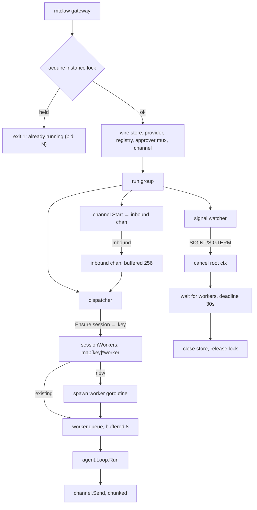

# Phase 7: Gateway Orchestration

## Overview

Wire everything into the long-running `mtclaw gateway` process: inbound queue,
per-session serialization, in-flight cancellation, single-instance locking, and
graceful shutdown. After this phase MTClaw is a working product.

## Requirements

**Functional**
- `mtclaw gateway` starts the store, provider, tool registry, channel, and dispatcher.
- Inbound messages queue and dispatch with **at most one turn per session at a time**,
  while different sessions run concurrently.
- Bounded queue with a defined overflow behaviour.
- `/stop` cancels the in-flight turn for its session.
- SIGINT/SIGTERM drains in-flight turns within a deadline, then exits.
- Single-instance lock prevents a second gateway from polling the same token.
- Tool progress surfaced to the user for slow tools.

**Non-functional**
- No HTTP server, no RPC, no IPC. The gateway's only inbound surface is Telegram long
  polling.
- One goroutine per active session, not one per message.

## Architecture

### Per-session serialization

`key = channel + ":" + chatID + ":" + threadID`. One worker goroutine per key, each
owning a small buffered queue. Rationale: two concurrent turns in one chat interleave
tool side effects and produce two conflicting `Append` writes for overlapping
history — the model ends up reading its own half-written turn. Different chats have
no shared state, so they run in parallel freely.

Worker lifetime: spawned on first message, exits after an idle timeout (5 min) and
removes itself from the map under the same mutex that guards insertion. Idle-exit
matters because a public-ish bot accumulates chats.

**The reap/enqueue race, and why the obvious implementation drops messages.** The naive
dispatcher takes the mutex, looks up the worker, releases the mutex, then sends to
`worker.queue`. A worker whose idle timer fires in that window exits, and the message
lands in a channel with no receiver — the user gets silence, which is indistinguishable
from the bot being broken. Fix: the worker's decision to exit and the dispatcher's
enqueue must be serialized by the same mutex. Concretely, the worker takes the lock,
re-checks that its queue is empty, sets `closing = true`, deletes itself from the map,
then releases and returns; the dispatcher holds the lock across lookup *and* the
non-blocking send, treating `closing` as a miss and spawning a fresh worker. Holding a
mutex across a buffered non-blocking send is fine — it never blocks.

### Queue overflow

Both queues are bounded. Overflow is **not** silently dropped, because a dropped
message looks like the bot ignored the user:

- Session queue full (8 pending in one chat): reply once with "still working on the
  previous message, try again shortly" and drop the message. A user spamming a busy
  chat gets one honest answer, not silence and not a queue that grows forever.
- Global inbound queue full (256): log at warn and drop. This means something is
  badly wrong; the log is the signal.

### Global concurrency cap

Per-session serialization bounds one chat to one turn. It does **not** bound the
process: N active chats means N concurrent turns, each running a tool loop with up to
`max_iterations` provider calls. A busy group with several allowlisted users, or a
handful of cron jobs firing on the same minute, is an unbounded token bill and an
unbounded pile of concurrent `exec` children.

A weighted semaphore (`golang.org/x/sync/semaphore`, or a plain buffered-channel
counter to avoid the dependency) caps concurrent turns process-wide at 4. Workers
acquire before running a turn and release after. Sessions still queue independently;
they just wait for a slot. This is a cost and blast-radius control, not a performance
knob — a personal assistant has no reason to run more than a few turns at once.

### Cancellation and `/stop`

Each worker stores the `context.CancelFunc` of the turn it is running in a
`map[key]context.CancelFunc` guarded by a mutex. `/stop` looks up the key and cancels.
Phase 4 already guarantees a canceled turn flushes its partial transcript with a
background context, so cancel is safe rather than corrupting.

The turn context is derived from the root context, so shutdown cancels every in-flight
turn too — with the drain deadline giving them a chance to finish first.

### Startup order and shutdown order

Startup: lock → store (migrations) → provider → registry → approver mux
(`telegram` → `TelegramApprover`, `cron` → `DenyAllApprover`, keyed on
`meta.Channel` — phase 5) → channel → dispatcher → signal watcher. Any failure before the channel starts exits non-zero with
a clear message; there is no partially-running gateway.

Shutdown is the reverse, and the ordering is load-bearing: stop the channel's update
pump first (so no new inbound arrives), then drain workers, then close the store. Closing
the store while a worker is mid-`Append` loses a turn.

Shutdown must also cancel **pending approvals**. A turn blocked on an unanswered inline
button is not "in flight" in any useful sense — it is waiting on a human who is not
coming. Phase 6's approver selects on the turn context for exactly this reason, so
cancelling the root context releases those waiters immediately and the drain completes in
seconds rather than after `approval_timeout`.

### Instance lock

A file at `<state dir>/gateway.lock` containing the PID. On start: if the file exists
and that PID is alive, refuse to start and name the PID. If the PID is dead, the lock
is stale — remove and continue. Removed on clean shutdown. This is cooperative, not
kernel-enforced, which is enough to stop the actual failure mode (a user running
`mtclaw gateway` twice and getting HTTP 409s from Telegram with silently lost updates).

### Progress feedback

The `agent.Progress` callback from phase 4 is wired to the channel:

- Turn start → typing action, refreshed every 4s until the turn ends.
- A tool still running after 8s → send "running `<tool>`…" once per tool call. Below
  8s, say nothing; most tools return fast and the noise is worse than the silence.
- Exec awaiting approval → the approval message itself is the feedback.

## Related Code Files

- Create: `internal/gateway/gateway.go` — `New`, `Run`, wiring
- Create: `internal/gateway/dispatch.go` — worker map, spawn, idle reap, cancel registry
- Create: `internal/gateway/queue.go` — bounded queues, overflow handling
- Create: `internal/gateway/lock.go` — PID lock acquire/release/stale detection
- Create: `internal/gateway/shutdown.go` — signal watcher, ordered drain
- Create: `internal/gateway/progress.go` — `agent.Progress` → channel messages
- Create: `internal/gateway/dispatch_test.go`, `lock_test.go`, `queue_test.go`
- Create: `internal/cli/gateway_cmd.go`
- Modify: `internal/channel/telegram/commands.go` — `/stop` now cancels for real
- Modify: `internal/cli/doctor_cmd.go` — add the lock check

## Implementation Steps

1. `lock.go`: `Acquire(path) (release func(), err error)`. Write the PID with
   `O_CREATE|O_EXCL`; on `EEXIST` read the PID and probe liveness
   (`os.FindProcess` + `Signal(syscall.Signal(0))` on POSIX; `OpenProcess` semantics via
   `os.FindProcess` returning an error on Windows). Stale → remove and retry once.
2. `gateway.go`: `New(cfg, log) (*Gateway, error)` doing the wiring in startup order,
   returning a typed error naming what failed. `Run(ctx) error` starts the goroutines
   and blocks.
3. `dispatch.go`:
   - `sync.Mutex` + `map[string]*worker`, each worker carrying a `closing bool`
   - `dispatch(in Inbound)`: `Sessions().Ensure(...)`, compute key, then **under the
     lock**: look up the worker, treat `closing` as a miss and spawn a replacement,
     non-blocking send to its queue, overflow → the honest reply above. Do not release
     the lock between lookup and send (see the race above).
   - worker loop: for each queued message, acquire the global turn semaphore, create a
     per-turn context, register its cancel func, run the loop, unregister, release the
     semaphore, send the reply unless `NoReply`, reset the idle timer
   - idle reap: on timer fire, take the lock, re-check the queue is empty, set
     `closing`, delete from the map, release, return
4. `queue.go`: the two bounded channels plus a tiny helper for non-blocking send with
   an overflow callback, so the policy is in one place and testable.
5. `progress.go`: translate `Event`s into typing refresh and slow-tool notices; hold the
   8s timers per tool call id.
6. `shutdown.go`: `signal.NotifyContext` for SIGINT/SIGTERM. On signal: log, cancel the
   channel context, wait on the worker `WaitGroup` with a 30s deadline, log any
   workers still running at the deadline, then return so `Run`'s deferred store close
   and lock release fire. The deadline is a package constant, not a config key — nobody
   tunes shutdown timeouts, and the schema is already large.
7. `gateway_cmd.go`: load config, require `channels.telegram.enabled`, build, run, map
   errors to exit codes. Log a startup banner: version, model, exec mode, workspace,
   bot username, DB path. **`auto` exec mode prints a warning line here.**
8. Wire `/stop` to the cancel registry; reply with whether anything was actually
   canceled.

## Tests / Validation

- **Serialization**: two messages for one session with a fake loop that records
  start/end timestamps — assert no overlap. Two messages for different sessions —
  assert overlap does occur (otherwise concurrency is broken).
- **Overflow**: fill one session queue past 8, assert exactly one "still working" reply
  and no lost earlier messages.
- **Idle reap**: worker exits after the idle timeout and a later message respawns it;
  assert no goroutine leak with `goleak` or a runtime goroutine count check.
- **Reap/enqueue race** (run with `-race`, and in a loop): hammer `dispatch` for one
  session with the idle timeout set to ~1ms so reaping and enqueueing interleave
  constantly. Assert **every** dispatched message is eventually processed — a count, not
  a smoke test. This is the test that would have caught the dropped-message race.
- **Global cap**: with the semaphore at 2, dispatch to 5 distinct sessions and assert at
  most 2 turns run concurrently while all 5 eventually complete.
- **Cancellation**: `/stop` mid-turn cancels, partial transcript persists, worker stays
  alive for the next message.
- **Shutdown**: SIGTERM during an in-flight turn — turn completes (short fake turn),
  store closes after, lock file removed. Then the same with a turn longer than the
  deadline: assert exit still happens and is logged.
- **Lock**: second `Acquire` fails while held; a lock file with a dead PID is treated as
  stale; the file is gone after release.
- Manual end-to-end: DM the bot, verify reply; send two messages fast, verify ordering;
  run a slow command, verify the typing indicator and the slow-tool notice; Ctrl-C
  mid-turn and confirm a clean exit.

## Success Criteria

- [ ] `mtclaw gateway` runs a full Telegram round trip end to end (needs a real bot token; not exercised in this environment - manual follow-up)
- [x] Two messages in one chat process in order, never concurrently
- [x] Messages in different chats process concurrently, capped at 4 turns process-wide
- [x] No dispatched message is ever dropped by worker reaping (asserted under `-race` with a 1ms idle timeout)
- [ ] Shutdown with a pending approval completes in seconds, not `approval_timeout` (holds by composition - rootCtx cancellation reaches Approver.Ask via the phase 6 select-on-ctx path, and shutdown drain timing is tested - but no dedicated test exercises a live pending approval during gateway shutdown; manual follow-up)
- [x] A flooded chat gets one honest "still working" reply, never silence
- [x] `/stop` cancels the running turn and the session remains usable afterwards
- [x] SIGTERM drains in-flight turns, then closes the store and releases the lock
- [x] A second `mtclaw gateway` refuses to start and names the running PID
- [x] A stale lock file from a killed process does not block startup
- [x] Idle sessions do not leak goroutines
- [x] The startup banner reports version, model, exec mode, and bot username; `auto` mode warns
- [x] No HTTP listener is opened (verified by grep across internal/ - no net/http.ListenAndServe, http.Serve, or net.Listen anywhere)

## Risk Assessment

- **Concurrent turns in one session** silently corrupt history — the failure surfaces
  later as confused model behaviour rather than an error, which makes it expensive to
  diagnose. The serialization test asserting non-overlap is the guard.
- **Shutdown ordering.** Closing the store before workers drain loses turns; stopping the
  channel after workers drain lets new work in during shutdown. Both orderings must be
  asserted, not assumed.
- **Worker map leak vs the reap race.** Without idle reaping, every chat that ever
  messaged the bot holds a goroutine and a queue for the process lifetime. Reaping
  introduces the spawn/reap/enqueue race documented above, whose symptom — a silently
  dropped message — is far worse than the leak it fixes. If the locking discipline proves
  awkward in practice, the correct fallback is **no reaping** (accept the leak; a personal
  bot has tens of chats, not millions), not a partially-locked reap.
- **Cooperative PID lock is not airtight** — a container restart with a recycled PID
  could false-positive. Acceptable: the failure is a refused start with a clear message,
  which the user can resolve by deleting the file.
- **Drop-on-overflow is a product decision.** Bounded queues are correct, but the reply
  text is what stops it from feeling like a bug. Do not implement the bound without the
  reply.
- **A pending approval holds a global turn slot.** The worker acquires the 4-slot
  semaphore before the turn, and an exec approval blocks inside the turn for up to
  `approval_timeout` (5m default) — four unanswered prompts stall every chat. Accepted
  for v1: the wait is bounded, selects on ctx, and `/stop` frees the slot. If it bites
  in practice, release the slot around `Approver.Ask` and reacquire after — do not
  raise the cap to compensate.
