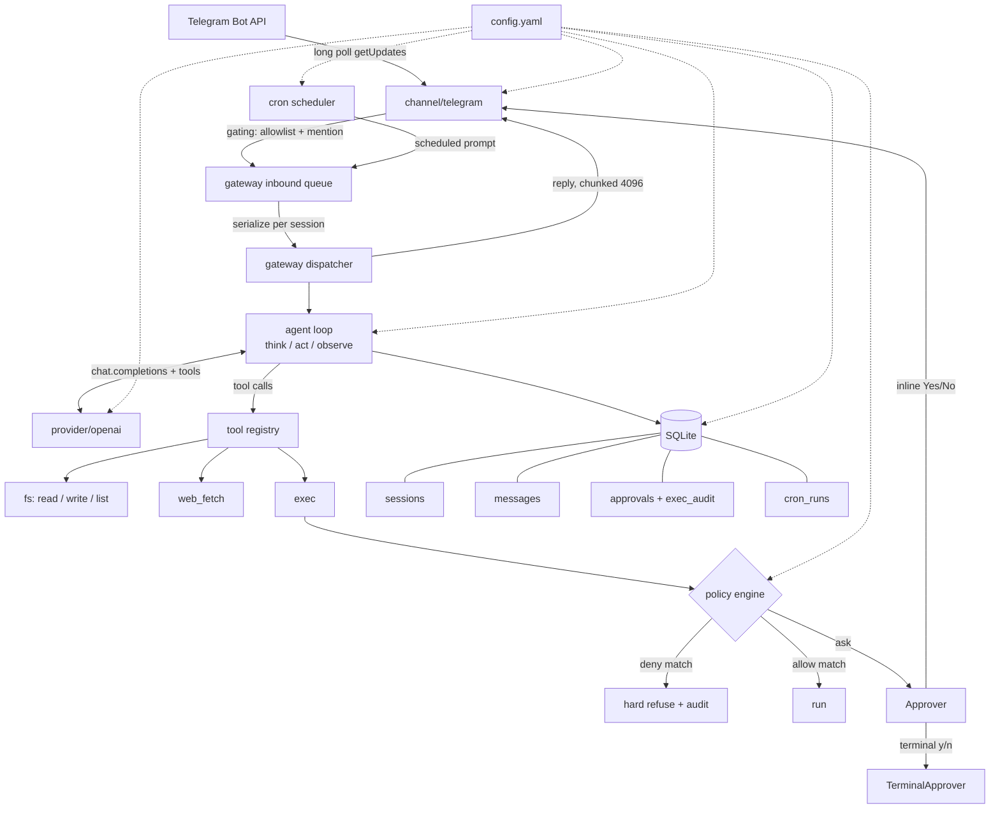
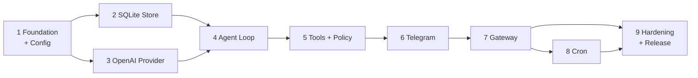

# MTClaw Core System

## Overview

MTClaw is a single-binary personal AI agent gateway: a long-running process that
receives Telegram messages, runs an OpenAI-backed agent loop with real tools
(filesystem, shell, web fetch), and replies in chat. Everything is configured by
one YAML file. There is no dashboard, no web UI, and no HTTP/RPC control surface.

It is deliberately a *small* reimplementation of the OpenClaw shape, not a port
of its feature set. See [Reference Analysis](#reference-analysis) for what was
intentionally dropped.

**Locked decisions** (from planning interview):

| Decision | Choice | Rationale |
|----------|--------|-----------|
| Language | Go 1.25+ | Single static binary, no runtime dep, native concurrency for poll→queue→agent. Port structure from goclaw. |
| Provider | OpenAI only | Explicit scope. `openai.base_url` is configurable, so OpenAI-compatible endpoints work incidentally but are untested/unsupported. |
| Channel | Telegram only | Long polling — no public URL, no TLS, no webhook infra. |
| Config | YAML file + env | `~/.mtclaw/config.yaml`. Secrets by env var or file reference only, never inline. |
| Persistence | SQLite | One DB file. Enables `sessions list`, token accounting, exec audit, cron history. |
| Exec policy | Deny-list → allow-list → approval, plus `auto` mode (beta) | Layered. In `auto`, an LLM classifier judges each command and only interrupts for dangerous ones. Deny-list always wins and is never bypassed. |
| Extras | Cron included | Scheduled prompts delivered to Telegram. Skills, MCP, memory, multi-agent deferred. |
| Dropped | Dashboard / Control UI | Explicit scope. |

## Architecture



## Phases

| Phase | Name | Status |
|-------|------|--------|
| 1 | [Foundation and Config](./phase-01-foundation-and-config.md) | Pending |
| 2 | [SQLite Store](./phase-02-sqlite-store.md) | Pending |
| 3 | [OpenAI Provider](./phase-03-openai-provider.md) | Pending |
| 4 | [Agent Loop](./phase-04-agent-loop.md) | Pending |
| 5 | [Tools and Policy Engine](./phase-05-tools-and-policy-engine.md) | Pending |
| 6 | [Telegram Channel](./phase-06-telegram-channel.md) | Pending |
| 7 | [Gateway Orchestration](./phase-07-gateway-orchestration.md) | Pending |
| 8 | [Cron Scheduler](./phase-08-cron-scheduler.md) | Pending |
| 9 | [Hardening and Release](./phase-09-hardening-and-release.md) | Pending |

### Phase dependency graph



Phases 2 and 3 are independent of each other and may be built in parallel after
phase 1. Everything else is strictly sequential.

**Phase 4 is the first runnable milestone**: `mtclaw prompt "..."` works as a persistent
terminal chat client with no tools. **Phase 5 is the first *useful* one** — the same
command becomes a complete tool-using agent, still with no Telegram code in the binary.
Build in this order specifically so the agent and its policy engine are provably working
before a chat surface can obscure where a bug lives.

## Repository layout

```
main.go                     # thin: calls internal/cli.Execute()
internal/
  cli/        root, gateway, config, prompt, send, sessions, cron, approvals, doctor, onboard, version
  config/     types, load (YAML + env overlay), defaults, validate, paths
  store/      interfaces + sqlite/ (open, migrations/*.sql, sessions, messages, approvals, audit, cron)
  provider/   interface + types, openai/ (client, chat, stream, errors)
  agent/      loop, prompt assembly, history trim
  tools/      registry, spec, fs, webfetch, exec, policy, classifier, approver
  channel/    interface + telegram/ (channel, poll, send, chunk, commands, gating, approver, format)
  gateway/    gateway, queue, dispatch, shutdown
  cron/       scheduler, job
  logging/    slog setup
  version/    build-stamped version
docs/         configuration.md, security.md, telegram-setup.md, architecture.md
```

## Dependencies

External Go modules, all verified current as of 2026-07-31:

| Module | Purpose | Notes |
|--------|---------|-------|
| `github.com/openai/openai-go/v3` | OpenAI client | v3.49.0. **Requires Go 1.25+** (v3.45+). Sets the language floor. |
| `github.com/mymmrac/telego` | Telegram Bot API | v1.6.0, active. Same library goclaw uses. Long polling + inline keyboards built in. |
| `modernc.org/sqlite` | SQLite driver | Pure Go, **CGO-free** — required for the static cross-compiled single binary. Same as goclaw. |
| `github.com/goccy/go-yaml` | YAML | **Not `gopkg.in/yaml.v3`** — that module is archived/unmaintained. goccy is dependency-free, actively maintained, gives line/column errors and `DisallowUnknownField`. |
| `github.com/spf13/cobra` | CLI | v1.10.2. No viper — env overlay is hand-rolled so precedence is explicit and testable. |
| `github.com/adhocore/gronx` | Cron expressions | Active. Expression parser only; scheduler loop is ours, so overlap/catch-up policy stays under our control. `robfig/cron` was rejected: last commit 2024. |
| `github.com/mattn/go-shellwords` | Command tokenizing | For policy display and argv-mode exec. |
| `github.com/stretchr/testify` | Tests | Assertions only. |

Standard library for logging (`log/slog`), HTTP (`net/http`), embedding
(`embed` for migrations), and process signals.

## Reference Analysis

Research performed 2026-07-31 against both upstream projects.

**[openclaw/openclaw](https://github.com/openclaw/openclaw)** — TypeScript
monorepo, ~385k stars, 100+ `src/` subsystems. Config is JSON5 at
`~/.openclaw/openclaw.json`. Telegram via grammY, long polling default, pairing
DM policy, `groups: { "*": { requireMention: true } }`. Value taken: the config
key *shape* and the channel gating semantics (allowlist, mention gating, group
chat IDs under `channels.telegram.groups`, `-100…` supergroup IDs).

**[nextlevelbuilder/goclaw](https://github.com/nextlevelbuilder/goclaw)** — Go,
~3.5k stars (note: org is `nextlevelbuilder`, singular; `nextlevelbuilders`
404s). 60+ `internal/` packages, Postgres+SQLite dual store, WebSocket RPC v3,
multi-tenant, teams, sandbox, hooks. Its `docs/00-architecture-overview.md`
through `24-*.md` series is the best available porting reference. Value taken:
the Think→Act→Observe loop shape, the `internal/` package boundaries, and the
validated dependency set (telego, modernc sqlite, cobra, gronx, shellwords).
Notably goclaw hand-rolls its LLM providers over `net/http` + SSE rather than
using an SDK; we use the official `openai-go` instead since we only need one
provider and the SDK removes real work.

**Deliberately not built** (each is a plausible follow-up plan, none is needed
for a working assistant): dashboard/Control UI, non-Telegram channels, non-OpenAI
providers, WebSocket/HTTP API, multi-tenancy, agent teams/delegation/subagents,
skills (`SKILL.md`), MCP bridge, vector memory + consolidation, Docker sandbox,
lifecycle hooks, pairing codes, media/TTS/STT, tracing/OTel, browser control,
knowledge graph, RBAC.

## Acceptance Criteria

The plan is complete when all of the following hold:

- [ ] `go build ./...` produces a single binary with no CGO and no runtime deps
- [ ] `mtclaw onboard` writes a valid `~/.mtclaw/config.yaml` from an empty machine
- [ ] `mtclaw config validate` rejects unknown keys, bad cron expressions, and inline secrets with line-numbered errors
- [ ] `mtclaw doctor` verifies config, DB, OpenAI reachability, Telegram `getMe`, workspace, and shell
- [ ] `mtclaw prompt "list files in my workspace"` completes a full tool-using agent turn in the terminal
- [ ] `mtclaw gateway` serves a Telegram DM end to end: message → agent → tool → chunked reply
- [ ] A non-allowlisted Telegram user gets no agent turn and no reply
- [ ] A group message without a mention is ignored when `require_mention: true`
- [ ] A deny-listed command is refused without ever prompting the user, and is recorded in `exec_audit`
- [ ] An allow-listed command runs with no prompt
- [ ] An unmatched command in `approval` mode produces inline Yes/No buttons; Deny returns a refusal to the model as a tool result, not an error
- [ ] In `auto` mode, a dangerous command still prompts, and classifier failure falls back to prompting (fail-closed)
- [ ] Sessions and history survive a gateway restart
- [ ] A cron job fires on schedule and delivers to the configured chat, with the run recorded in `cron_runs`
- [ ] Two concurrent gateways with the same token is detected and refused, not left flapping on HTTP 409
- [ ] `go test ./...` passes with the policy engine, config loader, chunker, and gating logic covered by table tests
- [ ] `docs/configuration.md` documents every config key; `docs/security.md` states the exec threat model plainly

## Risks

| Risk | Severity | Mitigation | Phase |
|------|----------|-----------|-------|
| Prompt injection reaching `exec` — untrusted text in a fetched page or forwarded message convinces the model to run a destructive command | **Critical** | Deny-list is the enforcement boundary and is checked before everything else; workspace confinement; every decision audited; `auto` mode ships off by default and labeled beta; `docs/security.md` states plainly that the LLM classifier is *not* a security control | 5 |
| Deny-list patterns that look right but do not match — red team found `rm --recursive --force /` and `/bin/rm -rf /` both bypassing the original default list | **Critical** | Patterns rewritten for long options and path prefixes; a must-catch/must-not-catch corpus is a required phase deliverable, and the security checklist re-verifies both bypasses by hand | 5, 9 |
| Secrets published to Telegram — a command carrying an inline token is echoed into an approval prompt and retained on Telegram's servers | High | `RedactSecrets` applied to approval prompts and audit rows; documented as best-effort, with "don't pass credentials as arguments" as the real rule | 5 |
| Unbounded spend — N chats or cron jobs each running a tool loop | Medium | Global concurrent-turn semaphore (4); per-session serialization; bounded queues; token usage logged per turn and per cron run | 7, 8 |
| Silent message loss from the worker reap/enqueue race | Medium | Reap decision and enqueue serialized under one mutex with a `closing` flag; asserted by a `-race` test with a 1ms idle timeout; fallback is to drop reaping entirely | 7 |
| Bot token leak = shell on the host | **Critical** | Allowlist fails closed (empty = deny all); secrets never inline in config; single-instance lock | 1, 5, 6 |
| LLM classifier in `auto` mode is itself injectable | High | Classifier runs on the command string only, never on page content; deny-list precedes it; any classifier error/timeout falls back to asking | 5 |
| SQLite write contention between gateway and CLI | Medium | WAL + `busy_timeout=5000`; the gateway is the only *sustained* writer; CLI session commands are read-only except `sessions rm`, which WAL serializes against an in-flight turn | 2 |
| Telegram `parse_mode` 400s on model-generated markdown | Medium | Send with markdown, on 400 retry the same chunk as plain text | 6 |
| Duplicate long-polling consumers → HTTP 409 update loss | Medium | PID lock file in state dir + `doctor` check | 7 |
| Malformed tool-call JSON from the model | Low | Unmarshal failure is returned to the model as a tool *result* describing the error, so it can retry, rather than aborting the turn | 4 |
| Unbounded context growth | Low | Hard turn-count trim only; overflow additionally recovers via one `ErrContextLength` retry. No summarization in v1 — old turns are simply forgotten | 4 |
| Windows vs POSIX shell divergence | Low | `tools.exec.shell` is an explicit argv array in config; onboard writes the right default per OS; deny patterns documented as shell-specific | 5 |

## Red Team Review

### Session — 2026-07-31
**Findings:** 18 (15 accepted, 3 rejected)
**Severity breakdown:** 5 High, 9 Medium, 1 Low (0 Critical as raised; two accepted High
findings were subsequently promoted to Critical rows in the risk table above)

Adaptations to the review protocol, stated rather than glossed: the four hostile lenses
(Security Adversary, Failure Mode Analyst, Assumption Destroyer, Scope & Complexity
Critic) were run in-context instead of as parallel subagents, per this session's
no-subagent rule. The protocol's `file:line`-codebase-citation evidence filter was
adapted to plan-file citations plus externally verifiable facts, because this repository
contains no code — applied literally it would have auto-rejected every finding.

| # | Finding | Severity | Disposition | Applied To |
|---|---------|----------|-------------|------------|
| H1 | Default deny-list bypassed by `rm --recursive --force /` and `/bin/rm -rf /` | High | Accept | Phase 5, 9 |
| H2 | Pending approval has no ctx cancellation — blocks shutdown for `approval_timeout` | High | Accept | Phase 6, 7 |
| H3 | Worker reap/enqueue race silently drops messages | High | Accept | Phase 7 |
| H4 | `/stop` and shutdown do not kill a running exec child | High | Accept | Phase 5 |
| H5 | `onboard` Telegram-ID capture is a first-come hijack window | High | Accept | Phase 9 |
| M1 | Cron can double-fire within one due minute | Medium | Accept | Phase 8 |
| M2 | `gronx` API asserted wrongly (`IsDue` is a method returning `(bool, error)`) | Medium | Accept | Phase 8 |
| M3 | Approval prompts publish inline secrets to Telegram permanently | Medium | Accept | Phase 5 |
| M4 | Crash after a tool side effect leaves no history record it happened | Medium | Accept | Phase 4 |
| M5 | No global concurrency or spend cap | Medium | Accept | Phase 7 |
| M6 | "Gateway is the only writer" contradicted by `sessions rm` | Medium | Accept | Phase 2 |
| M7 | SSRF blocklist omits `0.0.0.0`, IPv4-mapped IPv6, IPv6 link-local | Medium | Accept | Phase 5 |
| M8 | `summarize_after_turns` is speculative machinery shipping disabled | Medium | Accept (cut) | Phase 1, 4 |
| M9 | "First runnable milestone" claim was off by one phase | Medium | Accept | plan.md, Phase 4, 5 |
| L1 | Gold plating: `reply_to_message` key and doctor's clock-skew check | Low | Accept (cut) | Phase 1, 6, 9 |
| R1 | Approvals cascade-delete defeats the audit trail | — | Reject | — |
| R2 | Docs-coverage test is over-engineering | — | Reject | — |
| R3 | `mtclaw send` duplicates doctor's token check | — | Reject | — |

**Rejection rationales.** R1: `exec_audit` is deliberately FK-free and outside the
cascade, so it already carries the durable audit; `approvals` is operational state.
R2: the config file is this product's entire user interface, so mechanically enforcing
its documentation is proportionate, not gold plating. R3: `send` has independent value
for scripted notifications beyond proving the token works.

**Not raised as actionable.** A YAGNI reviewer would cut `auto` exec mode — it is the
single largest removable piece of phase 5. It stays because it is an explicit user
decision and ships disabled. Recorded here only so the option is visible if schedule
pressure ever appears.

### Whole-Plan Consistency Sweep

Decision delta applied across all files after the accepted findings:

- `summarize_after_turns` removed from the phase 1 schema, the phase 4 requirements,
  architecture, implementation steps (renumbered), `Progress` events, file list, and risk
  section; the `sessions.summary` column is retained and documented as written by nothing
  in v1; plan.md's package layout and risk table updated to match.
- `reply_to_message` removed from the phase 1 schema and the phase 6 send logic.
- Clock-skew check removed from the phase 9 doctor table and implementation steps.
- "First runnable milestone" corrected in plan.md, phase 4, and phase 5 so all three
  agree that phase 4 runs and phase 5 is useful.
- Phase 2's writer invariant reworded to "one *sustained* writer" and reconciled with its
  own `sessions rm` command.
- Approval cancellation added in phase 6 and referenced from phase 7's shutdown ordering,
  so both files describe the same mechanism.
- New verification cases propagated into phase 5, 6, 7, 8 test sections, their success
  criteria, and phase 9's security checklist — no finding was applied without a
  corresponding assertion.

**Unresolved contradictions: none.**

## Open Questions

None blocking. Two items are decided-with-assumption and worth confirming at
implementation time:

1. **Default model.** Plan assumes the model is config-driven with no hardcoded
   default beyond what `onboard` writes, so no code change is needed when model
   names change.
2. **`mtclaw send` scope.** Implemented as a direct Telegram API call, not IPC to
   a running gateway. This avoids adding any RPC surface in v1, at the cost of
   `send` not sharing the gateway's session context. Same for `cron run`, which
   executes in-process.
