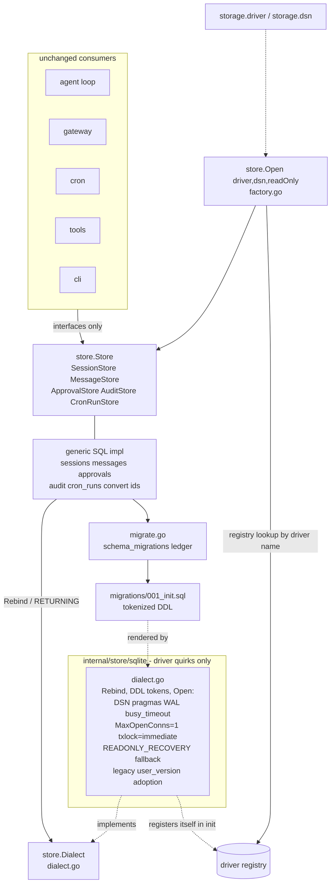
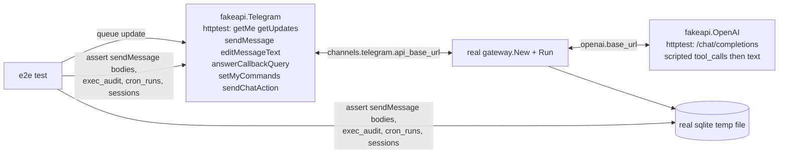
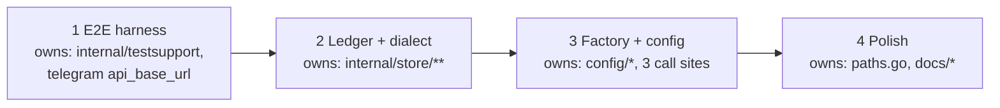

# Portable Store Seam and Credential-Free Verification

## Overview

Follow-on to [MTClaw Core System](../260731-2219-mtclaw-core-system/plan.md)
(completed, 9/9 phases). Three things, nothing else:

1. **Portable store seam.** SQLite stays the only shipped backend. After this
   work, adding a second one is one new package implementing `store.Dialect`,
   below an unchanged `store.Store`.
2. **Credential-free e2e verification.** Close the four unchecked v1
   acceptance criteria (`plan.md:194,196,203` of the v1 plan) as far as is
   possible with no OpenAI key and no Telegram token, by driving the *real*
   gateway against `httptest` fakes of both upstream APIs.
3. **Polish.** Accept `config.yml` alongside `config.yaml`; refresh docs; write
   down what genuinely still needs live credentials.

**Out of scope, deliberately:** every OpenClaw subsystem MTClaw does not have
(extra channels, extra providers, skills, MCP, memory, sandbox, hooks,
dashboard, multi-agent), and any second database backend. See
[Open Questions](#open-questions) for the one prerequisite argument that came
up and was rejected.

### Locked decisions carried in from scoping

| Decision | Choice |
|---|---|
| Portability depth | Seam only. No Postgres/MySQL code, no sqlc/Ent/GORM. |
| Config keys | New `storage.driver` (only `sqlite` valid) + `storage.dsn`. |
| `storage.path` | **Kept as a deprecated alias**, never removed in this plan — see [Decision: path vs dsn](#decision-path-vs-dsn). |
| Credentials | None available. Nothing gets ticked that a test does not assert. |
| CGO | `CGO_ENABLED=0` static binary preserved; no new module dependencies at all. |

## Architecture

The seam. Everything above `store.Store` is untouched; everything
SQLite-specific ends up inside the dotted box.



Verification harness (phase 1). No production code path is stubbed: the real
`telego` bot, the real `openai-go` client, the real gateway, the real store.



## Phases

| Phase | Name | Effort | Status |
|-------|------|--------|--------|
| 1 | [E2E Verification Harness](./phase-01-e2e-verification-harness.md) | 6h | Completed |
| 2 | [Portable Migration Ledger and Dialect Seam](./phase-02-portable-migration-ledger-and-dialect-seam.md) | 8h | Completed |
| 3 | [Store Factory and Storage Config](./phase-03-store-factory-and-storage-config.md) | 4h | Completed |
| 4 | [Polish, Docs, Manual Checklist](./phase-04-polish-docs-and-manual-checklist.md) | 2h | Completed |

### Phase dependency graph



Strictly sequential. Two justified orderings:

- **Harness first, before the store surgery.** Phase 2 is a large
  behaviour-preserving move of every query file with no user-visible change —
  exactly the shape of refactor that silently breaks something no unit test
  watches. Phase 1 builds the regression net that phase 2 then runs against.
  It also front-loads the user-visible win (four v1 criteria closed).
- **No parallelism**, even though phases 1 and 2 touch disjoint packages:
  phases 1, 3 and 4 all edit `internal/config/types.go` and
  `docs/configuration.md`, and `internal/config/docs_coverage_test.go:65`
  fails the build if a new key lands without its doc row. Serializing is
  cheaper than merging that file three ways.

## Repository layout delta

```text
internal/store/
  store.go                       unchanged (interfaces)
  types.go                       unchanged (row structs)
  dialect.go                     NEW  Dialect interface + DDL token rendering
  factory.go                     NEW  Open(cfg) + Register(driver)
  migrate.go                     NEW  embed, schema_migrations ledger, apply
  migrations/001_init.sql         MOVED up from sqlite/migrations/, tokenized
  sessions.go messages.go        MOVED up from sqlite/, SQL rebound via Dialect
  approvals.go audit.go
  cron_runs.go convert.go ids.go
  sqlite/
    dialect.go                   NEW  the whole of today's open.go, reshaped
    open.go sessions.go ...      DELETED (moved up)
    migrations/                  DELETED (moved up)
    store_test.go migrate_test.go  kept, become `package sqlite_test`
    testdata/v1_legacy_schema.sql  NEW  frozen v1 DDL, for the adoption test

internal/testsupport/
  homedir.go                     NEW  fake HOME (no `testing` import)
  fakeapi/telegram.go            NEW  httptest Bot API server
  fakeapi/openai.go              NEW  httptest chat-completions server

internal/gateway/e2e_test.go     NEW  DM round trip, approval, cron delivery
internal/cli/prompt_e2e_test.go  NEW  `mtclaw prompt` tool-using turn
docs/verification.md             NEW  what CI proves vs what needs credentials
```

New config keys (all three require a `docs/configuration.md` row in the same
phase, enforced by `internal/config/docs_coverage_test.go:65`):

| Key | Phase | Default | Why |
|---|---|---|---|
| `channels.telegram.api_base_url` | 1 | `""` (= `https://api.telegram.org`) | The only way to point the real channel at a fake server; also the documented way to use a self-hosted Bot API server. |
| `storage.driver` | 3 | `sqlite` | Factory dispatch. |
| `storage.dsn` | 3 | `~/.mtclaw/mtclaw.db` | Canonical replacement for `storage.path`. |

### Decision: `path` vs `dsn`

`storage.dsn` becomes canonical; **`storage.path` stays as a deprecated,
still-working alias** with `yaml:"path,omitempty"`.

- Only `path` set → used verbatim, with a load-time deprecation warning on
  stderr. Every existing config and every existing on-disk DB keeps working
  with no user action. This is the compatibility contract.
- Only `dsn` set → used.
- **Both set → validation error** (`storage.dsn`/`storage.path`: set only
  one). Silently preferring one would let a user edit the wrong key and think
  they moved their database.
- Neither → default DSN.
- One read path for all consumers: `StorageConfig.EffectiveDSN()`. `Load`
  additionally normalizes `path` into `dsn` and clears `path`, so
  `mtclaw config show` teaches the new key.
- Tilde/relative expansion and the parent-directory-creatable check apply
  **only when `driver == "sqlite"`** — a DSN is a file path for SQLite and a
  URL for anything else. That `switch` lives in `internal/config`, which
  deliberately does not import `internal/store` (see
  [Risks](#risks), R7).

Rationale for keeping the alias rather than renaming outright: v1 shipped and
`storage.path` is in every existing config, in `docs/configuration.md:131`, and
in `internal/provider/openai/e2e_test.go:40`. A hard rename buys nothing and
breaks people. Deprecation without a removal date is the honest state; a
future major version can drop it.

### Decision: migration-ledger cutover

`PRAGMA user_version` (`internal/store/sqlite/open.go:213,247`) is replaced by
a portable table:

```sql
CREATE TABLE IF NOT EXISTS schema_migrations (
  version    INTEGER PRIMARY KEY,
  name       TEXT NOT NULL,
  applied_at INTEGER NOT NULL
);
```

Cutover on a write open: bootstrap the ledger, and **if it is empty while the
dialect reports a non-zero legacy version, adopt** — insert one row per
version `1..legacy` — all inside the same transaction, then apply anything
newer. An existing v1 database therefore migrates its *bookkeeping* and not
its schema, and never re-runs `001_init.sql`.

`PRAGMA user_version` is deliberately **not** reset to 0. Instead the SQLite
dialect sets it to `max(applied version)` after every successful migrate. A v1
binary opening a post-cutover database still sees `1` and opens fine (schema
identical); once a real `002_*.sql` ever ships, that same v1 binary sees `2`,
exceeds its own highest known migration, and refuses — its existing
downgrade guard (`open.go:216-218`) keeps working for free. Three lines, and
it is the only reason an old binary does not corrupt a new database.

## Acceptance Criteria

Objective and mechanically checkable. Every box maps to a named test or a
named command.

**Store seam (phases 2-3)**

- [x] `internal/store/sqlite/` contains no SQL statement naming an MTClaw table (`rg -n 'sessions|messages|approvals|exec_audit|cron_runs' internal/store/sqlite/*.go` matches only comments and the legacy-adoption probe) - re-verified 2026-08-08: 21 matches, all comments or `_test.go` fixtures
- [x] `grep -rn 'PRAGMA' internal/store/*.go` returns nothing (pragmas live only in `sqlite/dialect.go`) - re-verified, empty
- [x] `grep -rn 'AUTOINCREMENT' internal/store/migrations/` returns nothing (tokenized as `{{IDENTITY}}`) - re-verified, empty
- [x] `grep -rn 'LastInsertId' internal/store/` returns nothing (all identity inserts use `RETURNING`) - re-verified, empty
- [x] No query in `internal/store/*.go` emits `LIMIT -1`; unlimited means the clause is omitted - re-verified, empty
- [x] `grep -rn 'modernc.org/sqlite' internal/ --include=*.go` matches only `internal/store/sqlite/` - re-verified, empty outside that directory
- [x] `grep -rn 'store/sqlite' internal/ --include=*.go` outside `internal/store/` matches only blank imports (`_ "…/internal/store/sqlite"`) - re-verified: 6 blank imports + 1 pre-existing, out-of-scope comment (`internal/channel/telegram/approver_test.go:23`, prose only, not an import)
- [x] A test opens a database created from `internal/store/sqlite/testdata/v1_legacy_schema.sql` with `PRAGMA user_version = 1` and asserts: no DDL re-run, `schema_migrations` has exactly one row (version 1), and a session written before the upgrade is still readable - `TestOpen_LegacyDatabaseAdoptsExistingSchemaVersion`
- [x] A test asserts a database whose `schema_migrations` max version exceeds the highest embedded migration is refused in both read-only and read-write mode - `TestOpen_NewerLedgerVersionIsRefused`
- [x] A test asserts `PRAGMA user_version` equals the highest applied migration after a fresh migrate - `TestOpen_FreshDatabaseMigratesToLatest`
- [x] A test asserts WAL, `busy_timeout=5000`, `foreign_keys=ON` on both the writer and the reader handle, and that the writer pool is capped at one connection - `TestPragmasAndPoolAreSetOnWriterAndReader`
- [x] `store.Open(ctx, config.StorageConfig{Driver:"sqlite", DSN:…}, false)` returns a working `store.Store`; `Driver:"postgres"` returns an error naming the supported drivers - `TestOpen_SQLiteDriverReturnsUsableStore`, `TestOpen_UnregisteredDriverNamesSupportedSet`
- [x] `mtclaw config validate` rejects a config that sets both `storage.path` and `storage.dsn`, and one whose `storage.driver` is not `sqlite` - `TestValidate_StorageBothDSNAndPathSet`, `TestValidate_StorageUnsupportedDriver`, plus re-verified by hand with a real binary (see phase 4's report)
- [x] A config containing only `storage.path` loads, warns once on stderr, and its `EffectiveDSN()` equals that path - `TestLoad_StoragePathAliasWarnsOnceAndNormalizes`
- [x] `docs/configuration.md` has rows for `storage.driver`, `storage.dsn`, `storage.path` (deprecated), `channels.telegram.api_base_url`; `go test ./internal/config/...` (docs coverage) passes - `TestConfigFieldsAreDocumented`

**Verification harness (phase 1)**

- [x] `internal/gateway/e2e_test.go` drives `gateway.New` + `gateway.Run` against `fakeapi.Telegram` and `fakeapi.OpenAI` and asserts a DM produces: one `read_file` tool call, a follow-up model request containing that tool's result, and a `sendMessage` to the originating chat with the final text - `TestE2E_DMRoundTrip_ToolCallFedBackAndChunkAwareReply`
- [x] The same test asserts a reply longer than `DefaultChunkLimit` arrives as more than one `sendMessage` - `TestE2E_ChunkedReply_SplitsAcrossMultipleSendMessageCalls`
- [x] An approval e2e asserts: an unmatched `exec` command in `approval` mode produces a `sendMessage` carrying `reply_markup` with two `callback_data` buttons; a scripted Approve callback runs the command; `exec_audit` records `approved`; `answerCallbackQuery` was called - `TestE2E_ApprovalApprove_RunsCommandAndAudits`
- [x] A Deny variant asserts the model receives a refusal as a *tool result* (visible in the next `fakeapi.OpenAI` request body) and the turn still completes - `TestE2E_ApprovalDeny_RefusalReachesModelAndAudits`
- [x] A cron e2e drives a real `cron.Scheduler` (fake clock) into the real dispatcher and asserts delivery to `deliver_to.chat_id` via `fakeapi.Telegram` plus a `cron_runs` row transitioning `started → ok` - `TestE2E_CronDelivery_RoutesToDeliverToChatAndRecordsRun`
- [x] A separate assertion proves `gateway.New` itself constructs a scheduler when `cron.enabled: true` (closes the wiring gap the fake-clock test bypasses) - `TestE2E_GatewayNew_BuildsCronSchedulerOnlyWhenEnabled`
- [x] `internal/cli/prompt_e2e_test.go` runs the real `mtclaw prompt` command tree twice against `fakeapi.OpenAI`: the first asserts a completed tool-using turn on stdout, the second asserts the prior turn is in the replayed history (context survives process exit) - `TestE2E_PromptCompletesToolUsingTurn`
- [x] No e2e test reads `OPENAI_API_KEY`, `TELEGRAM_BOT_TOKEN`, or `MTCLAW_E2E`; all pass with no network egress - confirmed in phase 1's report, re-run clean this phase too
- [x] No e2e test writes to the real `~/.mtclaw` (each uses `testsupport` fake HOME) - confirmed, `testsupport.FakeHome` is the single implementation every caller delegates to

**Whole plan**

- [ ] `go test -race ./...` green on Windows and on Linux CI - **not verified, left unticked.** `-race` cannot run at all in this implementation environment (`CGO_ENABLED=0`, no C compiler on `PATH`) across all four phases. CI *is* configured to run it across the full OS matrix (`.github/workflows/ci.yml`), but the last actual run on `main` failed on all three legs, for two causes unrelated to this plan and outside every phase's file ownership: a nil-pointer panic in `internal/tools.TestExec_TimeoutKillsWholeProcessTree` under `-race` on Linux/macOS, and a Windows `gofmt` step failure (likely a CRLF/LF checkout mismatch) that pre-empts `-race` from ever running on that leg. See `docs/verification.md`'s "A note on `go test -race` and CI" section and the phase 4 implementation report for the full citation. Plain `go test ./...` is green modulo the 3 pre-existing, environmental (Windows symlink privilege) failures in `internal/tools`, repeated 5x with `-count=1` across every phase with no flakiness observed.
- [x] `CGO_ENABLED=0 go build ./...` green; `go.mod` `require` block is byte-identical to its pre-plan state - re-verified: build clean, `git diff go.mod go.sum` empty
- [x] `mtclaw doctor` still reports the DB check by opening through the factory, and its message names the DSN - re-verified by hand with a real binary: `OK   DB opens and migrates   <dsn> opens and is at the current schema version`
- [x] `mtclaw --config <file>.yml` and a bare `~/.mtclaw/config.yml` both load - re-verified by hand and by `TestConfigPath_DefaultAliasPrecedence`/`TestConfigPath_ExplicitFlagNeverAliasResolved`
- [x] `docs/verification.md` lists every remaining live-credential step with an exact command and expected output, and nothing that a test already asserts

## Risks

| # | Risk | Severity | Mitigation | Phase |
|---|---|---|---|---|
| R1 | Phase 2 is a ~1500-line behaviour-preserving move; a silent SQL regression (a dropped `WHERE`, a reordered scan) would surface only in production | **High** | Phase 1 lands first as the regression net; `store_test.go` moves as-is (external test package) rather than being rewritten; the `LIMIT`/`RETURNING` rewrites each get their own assertion | 1, 2 |
| R2 | Legacy-DB adoption misfires and re-runs `001_init.sql`, erroring on an existing table (looks like a corrupt database to the user) | **High** | Adoption keyed on `dialect.LegacyVersion() > 0` **and** ledger empty, in one transaction; frozen `testdata/v1_legacy_schema.sql` fixture test; adoption never executes DDL from a read-only handle | 2 |
| R3 | Downgrade: an old binary opens a post-cutover DB and mis-reads its schema | Medium | `PRAGMA user_version` kept in sync with `max(applied)` so the v1 binary's own guard still fires; documented in `docs/architecture.md` as a rule future migration authors must not break | 2 |
| R4 | Read-only open of a legacy DB tries to create `schema_migrations` and fails | Medium | Read path never writes: missing ledger falls back to the dialect's legacy version; behaviour parity with today's "behind the latest migration, open it for writing once" error is asserted | 2 |
| R5 | `telego` cannot be pointed at an `httptest` server on Windows (fasthttp caller, token regex `^\d+:[\w-]{35}$`) — the harness premise collapses | **High** | Phase 1 step 1 is a ~30-line spike proving `WithAPIServer` + long polling against `httptest` on Windows *before* anything else is built; verified available: `telego@v1.11.1/bot_options.go:111`; if the spike fails, fall back to `WithHTTPClient` + a custom `http.RoundTripper`, and only if that also fails to a `botAPI`-level fake (which would forfeit the real-transport property) | 1 |
| R6 | Fake `getUpdates` returning immediately makes `telego` spin at 100% CPU (our channel sets `Timeout: 30`, `UpdateInterval: 0` — `channel.go:150-153`) | Medium | The fake blocks up to 250ms waiting on an internal queue before returning an empty result; it never returns a non-2xx, because `WithLongPollingRetryTimeout(8s)` (`channel.go:152`) would otherwise stall a test for 8 seconds | 1 |
| R7 | `internal/config` needs DSN semantics that only a dialect knows, tempting a `config → store` import and a cycle (`store → config` already exists via the factory) | Medium | `config` keeps a two-line `if driver == "sqlite"` switch for path expansion, explicitly commented as the place a second driver must edit. One-way dep: `sqlite → store → config`, `config` imports nothing internal | 3 |
| R8 | Driver registry (`database/sql` pattern) means a forgotten blank import fails at runtime, not compile time | Medium | Exactly three production wiring sites, all listed in phase 3; error text names the fix; a test asserts `store.Open` with an unregistered driver names the supported set | 3 |
| R9 | New `channels.telegram.api_base_url` leaks the bot token to whatever host it names | Medium | Validated as an absolute `http(s)` URL; `docs/configuration.md` states plainly it is a token-trust boundary; default empty; no doctor check needed since `getMe` already fails loudly against a wrong host | 1 |
| R10 | E2E tests become the flaky ones everybody skips | Medium | No fixed sleeps — reuse `waitCond` (`internal/gateway/gateway_test_helpers_test.go:98`); fake servers are deterministic queues; every test has an explicit timeout and a `t.Cleanup` cancel; `-race` in CI | 1 |
| R11 | `t.Setenv` for the fake HOME forbids `t.Parallel`, silently serializing the suite | Low | Accepted; e2e tests are few and sub-second. Documented in `testsupport/homedir.go` | 1 |
| R12 | Dialect abstraction with one implementation is dead weight (YAGNI) | Low | Stated tension, not hidden: the seam is a locked user decision. Kept minimal — a dialect method exists only where today's code already varies by driver. No speculative `Postgres`/`MySQL` constants, no unused methods | 2 |
| R13 | `RETURNING`-everywhere policy forecloses MySQL/MariaDB forever | Low | Accepted and documented in `dialect.go`: MySQL is not a target; SQLite ≥3.35 and Postgres both support `RETURNING`, and `sessions.Ensure` (`sqlite/sessions.go:26-32`) already proves it works on `modernc.org/sqlite` | 2 |
| R14 | `.yml` alias creates ambiguity when both files exist | Low | `.yaml` wins; a one-line warning names the ignored file; explicit `--config`/`MTCLAW_CONFIG` paths are never alias-resolved | 4 |
| R15 | **Binary downgrade after the new `onboard` runs.** A config written by the new binary contains `driver`/`dsn`, which the old binary rejects outright — `yaml.DisallowUnknownField` (`internal/config/load.go:58`) makes unknown keys a load error, not a warning | Medium | Data is safe (R3 covers the database); only the config file blocks a rollback, and the fix is renaming `dsn:` → `path:` and deleting `driver:`. Stated in phase 3's rollback section and required in the release notes. Not fixable in-plan: v1 is already shipped and cannot learn to ignore future keys | 3 |

## Red Team Review

### Session — 2026-08-08 (self-critique, pre-approval)

Four lenses run in-context (Assumption Destroyer, Failure Mode Analyst, Scope
Critic, Security Adversary). 13 findings: 11 accepted and already folded into
the phase files above, 2 rejected. Every accepted finding changed a phase file;
none was recorded without a corresponding step or assertion.

| # | Finding | Severity | Disposition | Applied to |
|---|---|---|---|---|
| A1 | Original phase order put the store refactor first, so the largest no-behaviour-change diff in the project would have landed with no integration test watching it | High | Accept — harness moved to phase 1 | plan.md, P1, P2 |
| A2 | "Drive the real gateway" was impossible as written: `gateway.New` hardcodes `telegram.New` (`gateway.go:97`) which hardcodes `telego.NewBot` (`channel.go:61`) — no seam for a fake server | High | Accept — new `channels.telegram.api_base_url` key; rejected the alternatives (test-only exported constructor, `gateway.New` option struct) as less honest and no less invasive | P1 |
| A3 | The mock provider (`internal/provider/mock`) cannot be injected into `gateway.New` either (`gateway.go:74` hardcodes `openai.New`) — but `openai.base_url` already exists, so a fake HTTP server needs **zero** new seam and additionally exercises the real SDK client | Medium | Accept — harness uses `fakeapi.OpenAI`, not the mock provider. The mock stays for unit tests | P1 |
| A4 | Tests cannot set the resolved API key or bot token: both live in unexported fields written only by `setSecret` (`config/types.go:100,133`). A `config.Config` built by hand is unusable for e2e | Medium | Accept — harness must build config via `config.Load(yaml, dir, envMap)`, the pattern already used at `provider/openai/e2e_test.go:44` | P1 |
| A5 | Two latent portability bugs the brief's list missed: `LIMIT -1` as "unlimited" is SQLite-specific (`sessions.go:53`, `messages.go:71`, `audit.go:47`, `cron_runs.go:66`), and `LastInsertId` (`audit.go:33`, `cron_runs.go:29`) is unsupported by the standard Postgres driver | Medium | Accept — both fixed in phase 2; blockers list extended to 10 items | P2 |
| A6 | `store.Open` dispatching on driver name while living in `store` would import `sqlite`, which imports `store` → import cycle. The approved layout does not survive contact | High | Accept — `database/sql`-style registry + blank import; R8 covers the footgun | P2, P3 |
| A7 | Moving query files up would break `internal/store/sqlite/store_test.go` (in-package, needs both packages) with an import cycle in the test binary | Medium | Accept — those two test files become `package sqlite_test`; noted so an implementer does not "fix" it by re-duplicating queries | P2 |
| A8 | Cron e2e as first drafted would wait up to 60s for a real minute boundary (`cron/scheduler.go:114,139-142`) | Medium | Accept — inject a fake `now` near the minute boundary into a test-constructed `cron.Scheduler` wired to the *real* dispatcher, plus a separate cheap assertion that `gateway.New` builds a scheduler. Rejected exporting `Scheduler.tick` — no production change is needed | P1 |
| A9 | `gateway.New` acquires a PID lock under the real `~/.mtclaw` (`gateway.go:51-59`), so e2e runs would litter and collide on the developer's own machine | Medium | Accept — fake HOME, generalizing the helper that already exists at `cli/onboard_test.go:27-36` into `internal/testsupport` | P1 |
| A10 | Rollback of phase 3 is not symmetric: `yaml.DisallowUnknownField` (`config/load.go:58`) makes the old binary *reject* a config containing `driver`/`dsn`, so "just revert the commit" is false for anyone who re-ran `onboard` | Medium | Accept — recorded as R15 and in phase 3's rollback section; cannot be fixed in-plan because v1 already shipped | P3 |
| A11 | Phase 4 referenced a `paths_test.go` that does not exist (`internal/config/` has `load_test.go`, `validate_test.go`, `docs_coverage_test.go` only) | Low | Accept — corrected to `load_test.go`. Recorded because it is exactly the class of stale-scout error the plan is supposed to catch | P4 |
| R1 | "Add an `MTCLAW_STATE_DIR` env override so tests need not fake HOME" | — | Reject — a new production env var to serve tests, when `os.UserHomeDir` is already env-driven and a 9-line helper does the job | — |
| R2 | "Also add `storage.max_open_conns` / `storage.busy_timeout` while the config is open" | — | Reject — nothing asked for them, no bug motivates them, and each is a permanent documented key. `MaxOpenConns(1)` (`open.go:84`) is a correctness invariant, not a tuning knob | — |

**Uncertainties stated rather than papered over.**

1. **R5 is the only finding that can invalidate a phase.** Whether
   `telego`'s fasthttp caller long-polls an `httptest` server cleanly on
   Windows is *not* verified by reading source — `WithAPIServer` exists
   (`bot_options.go:111`) and the path shape is
   `<apiURL>/bot<token>/<method>` (`bot.go:238-240`), but the transport
   behaviour is empirical. Phase 1 step 1 is a spike precisely so this is
   answered in 20 minutes, not on hour six.
2. **`answerCallbackQuery` / `editMessageText` response shapes** must satisfy
   `telego`'s decoder; the fake returns `{"ok":true,"result":true}` for the
   former, a `Message` for the latter. If `telego` is stricter than expected
   the harness spends an extra hour on fixtures. Non-fatal.
3. **`cb.Message` is `MaybeInaccessibleMessage`** in telego v1.11
   (`approver.go:174-181` calls `cb.Message.GetChat()`), so the injected
   callback update must carry a fully-formed accessible message
   (`message_id`, `date`, `chat`). Exact required-field set unverified.
4. **Whether every one of the 440 lines of `store_test.go` moves cleanly** to
   an external test package depends on how much of it reaches for unexported
   helpers. Spot-checked, not line-by-line audited.

## Resolutions (2026-08-08, pre-implementation)

Decided by the user before phase 1 started. These close Open Questions 2-4 and
retire R5; the questions are kept below for the reasoning that produced them.

| Item | Resolution |
|---|---|
| **R5 — telego vs `httptest`** | **RESOLVED EMPIRICALLY, not a risk.** A throwaway spike ran `telego.NewBot(token, WithDiscardLogger(), WithAPIServer(srv.URL))` against an `httptest` server on Windows/`modernc` Go 1.25.7: `GetMe` ok, `UpdatesViaLongPolling` delivered an injected update, `SendMessage` ok and the fake observed a `{text, chat_id}` body. Phase 1 step 1's spike is therefore **already done** — implementers must not redo it, and the two named fallbacks (`WithHTTPClient` roundtripper, `botAPI`-level fake) are unnecessary. Fake token shape `^\d+:[\w-]{35}$` is required and satisfied by `123456789:` + 35 chars. |
| **R6 — confirmed necessary** | The same spike counted **4 `getUpdates` calls in ~400ms idle** with the fake sleeping 150ms per empty poll. A non-blocking fake would spin. The planned mitigation (fake blocks up to 250ms on an internal queue, never returns non-2xx) is load-bearing, not defensive. |
| **OQ4 — `channels.telegram.api_base_url`** | **Approved as a real, permanent, documented config key.** The test-only-constructor alternative is rejected: `gateway.New` would still need an options parameter, so it is no less invasive and less honest. Document it in `docs/configuration.md` as a token-trust boundary (R9) and as the supported way to use a self-hosted Bot API server. |
| **OQ3 — `docs/verification.md` location** | Stays in `docs/`. It is run by a user or release engineer, not a planning artifact. |
| **OQ2 — `storage.path` deprecation horizon** | No removal date. Warn on load, keep working indefinitely; a future major version may revisit. |
| **OQ1 — second backend** | Confirmed out of scope. The mechanical acceptance criteria substitute for the missing second implementation; the trade-off is accepted knowingly. |

## Open Questions

1. **Is any out-of-scope subsystem a prerequisite?** No. One argument was
   considered and rejected: a *second real backend* would be the only true
   proof the seam works, and without it the dialect is unexercised
   abstraction (R12). Rejected because it is explicitly out of scope and
   because the acceptance criteria substitute mechanical proofs (no SQL in
   `sqlite/`, no `PRAGMA` in `store/`, no `LastInsertId` anywhere) for that
   missing second implementation. Flagging it so the trade-off is the user's,
   not smuggled in.
2. **Deprecation horizon for `storage.path`.** This plan warns and never
   removes. If the user wants a removal version, say so and phase 4 can add
   the sunset note to `docs/configuration.md`.
3. **Should `docs/verification.md` live in `docs/` or in
   `plans/…/reports/`?** Planned as `docs/verification.md` because it is a
   thing a *user* (or a release engineer) runs, not a planning artifact. Say
   the word and it moves.
4. **`channels.telegram.api_base_url` is a real user-facing feature** that
   exists mainly to make the harness possible. If the user would rather not
   grow the public config surface, the fallback is a test-only exported
   constructor in `internal/channel/telegram` — less honest, and
   `gateway.New` would still need an options parameter. Confirm the call.
